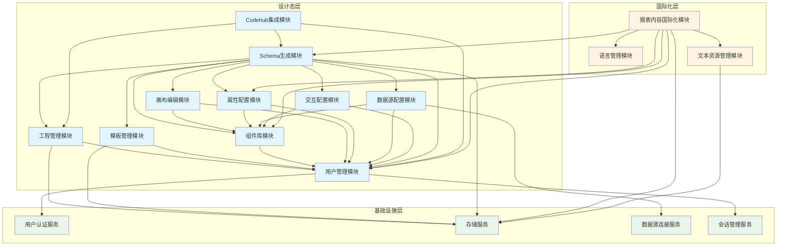
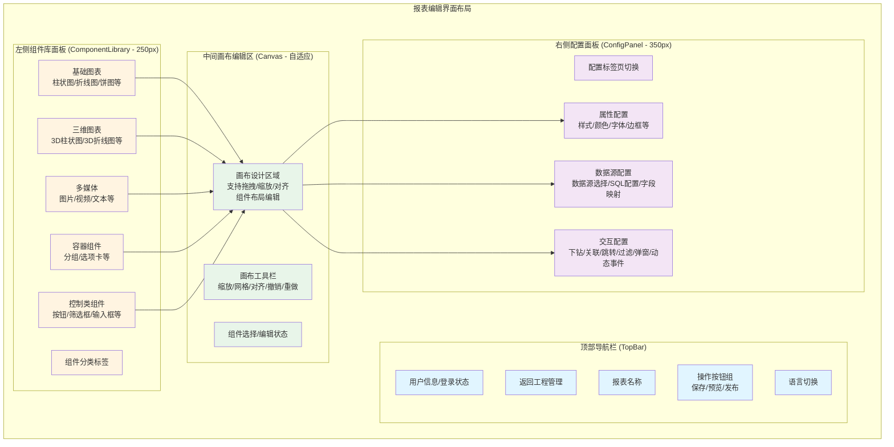

```mermaid
graph TB
    subgraph "工程管理界面布局 (100vw × 100vh)"
        subgraph "顶部导航栏 (TopBar - 高度: 60px, 宽度: 100%)"
            direction LR
            TB_LEFT[左侧区域<br/>Logo/系统名称]
            TB_CENTER[中间区域<br/>页面标题: 工程管理]
            TB_RIGHT[右侧区域<br/>用户信息显示<br/>退出登录按钮]
        end
        
        subgraph "主内容区 (MainContent - 高度: calc(100vh - 60px), 宽度: 100%)"
            subgraph "工具栏区域 (Toolbar - 高度: 60px, 宽度: 100%, 内边距: 20px)"
                direction LR
                TOOL_LEFT[左侧操作区<br/>创建工程按钮<br/>删除工程按钮<br/>刷新按钮]
                TOOL_CENTER[中间搜索区<br/>搜索框<br/>搜索图标]
            end
            
            subgraph "工程列表区域 (ProjectList - 高度: 自适应, 宽度: 100%, 内边距: 20px)"
                direction TB
                subgraph "列表表头 (TableHeader - 高度: 50px, 宽度: 100%)"
                    direction LR
                    TH_CHECKBOX[复选框<br/>宽度: 50px<br/>全选/取消全选]
                    TH_NAME[工程名称<br/>可排序<br/>宽度: 200px]
                    TH_TYPE[工程类型<br/>可排序<br/>宽度: 120px]
                    TH_DESC[工程描述<br/>宽度: 300px]
                    TH_CREATE[创建时间<br/>可排序<br/>宽度: 150px]
                    TH_ACTION[操作<br/>固定宽度: 300px]
                end
                
                subgraph "工程列表项1 (ProjectRow - 高度: 80px, 宽度: 100%)"
                    direction LR
                    PR1_CHECKBOX[复选框<br/>宽度: 50px]
                    PR1_ICON[工程图标<br/>宽度: 40px]
                    PR1_NAME[工程名称<br/>宽度: 200px<br/>可点击进入]
                    PR1_TYPE[工程类型<br/>宽度: 120px<br/>私有工程/公共工程]
                    PR1_DESC[工程描述<br/>宽度: 300px<br/>文本截断显示]
                    PR1_CREATE[创建时间<br/>宽度: 150px<br/>YYYY-MM-DD HH:mm]
                    PR1_ACTION[操作按钮组<br/>宽度: 300px<br/>导入模型/导出模型/提交Git]
                end
                
                subgraph "工程列表项2 (ProjectRow - 高度: 80px, 宽度: 100%)"
                    direction LR
                    PR2_CHECKBOX[复选框<br/>宽度: 50px]
                    PR2_ICON[工程图标<br/>宽度: 40px]
                    PR2_NAME[工程名称<br/>宽度: 200px<br/>可点击进入]
                    PR2_TYPE[工程类型<br/>宽度: 120px<br/>私有工程/公共工程]
                    PR2_DESC[工程描述<br/>宽度: 300px<br/>文本截断显示]
                    PR2_CREATE[创建时间<br/>宽度: 150px<br/>YYYY-MM-DD HH:mm]
                    PR2_ACTION[操作按钮组<br/>宽度: 300px<br/>导入模型/导出模型/提交Git]
                end
                
                subgraph "工程列表项N (ProjectRow - 高度: 80px, 宽度: 100%)"
                    direction LR
                    PRN_CHECKBOX[复选框<br/>宽度: 50px]
                    PRN_ICON[工程图标<br/>宽度: 40px]
                    PRN_NAME[工程名称<br/>宽度: 200px<br/>可点击进入]
                    PRN_TYPE[工程类型<br/>宽度: 120px<br/>私有工程/公共工程]
                    PRN_DESC[工程描述<br/>宽度: 300px<br/>文本截断显示]
                    PRN_CREATE[创建时间<br/>宽度: 150px<br/>YYYY-MM-DD HH:mm]
                    PRN_ACTION[操作按钮组<br/>宽度: 300px<br/>导入模型/导出模型/提交Git]
                end
            end
            
            subgraph "空状态区域 (EmptyState - 居中显示, 当无工程时显示)"
                ES_ICON[空状态图标<br/>📁 或 自定义图标]
                ES_TEXT[提示文字<br/>您还没有工程<br/>点击下方按钮创建您的第一个工程]
                ES_BUTTON[创建工程按钮<br/>主要操作按钮]
            end
            
            subgraph "分页区域 (Pagination - 底部居中, 当工程数量较多时显示)"
                PAGINATION[分页控件<br/>上一页/下一页<br/>页码选择<br/>每页显示数量]
            end
        end
        
        subgraph "创建工程对话框 (CreateProjectDialog - 模态框, 宽度: 600px, 居中显示)"
            direction TB
            DIALOG_HEADER[对话框头部<br/>标题: 创建工程<br/>关闭按钮]
            DIALOG_BODY[对话框主体<br/>表单区域]
            subgraph "表单内容"
                FORM_NAME[工程名称输入框<br/>必填项<br/>占位符: 请输入工程名称]
                FORM_DESC[工程描述输入框<br/>可选项<br/>占位符: 请输入工程描述<br/>多行文本]
                FORM_TYPE[工程类型选择<br/>必选项<br/>单选按钮组<br/>私有工程/公共工程]
            end
            DIALOG_FOOTER[对话框底部<br/>取消按钮<br/>确认按钮]
        end
        
        subgraph "导入模型对话框 (ImportModelDialog - 模态框, 宽度: 600px, 居中显示)"
            direction TB
            IMPORT_HEADER[对话框头部<br/>标题: 导入模型<br/>关闭按钮]
            IMPORT_BODY[对话框主体<br/>表单区域]
            subgraph "导入表单内容"
                IMPORT_REPO[Git仓库选择<br/>下拉框<br/>显示仓库列表]
                IMPORT_BRANCH[Git分支选择<br/>下拉框<br/>显示分支列表]
                IMPORT_STATUS[导入状态显示<br/>进度条/状态提示]
            end
            IMPORT_FOOTER[对话框底部<br/>取消按钮<br/>导入按钮]
        end
        
        subgraph "导出模型对话框 (ExportModelDialog - 模态框, 宽度: 500px, 居中显示)"
            direction TB
            EXPORT_HEADER[对话框头部<br/>标题: 导出模型<br/>关闭按钮]
            EXPORT_BODY[对话框主体<br/>提示信息<br/>确认导出当前工程的所有模型?]
            EXPORT_FOOTER[对话框底部<br/>取消按钮<br/>确认按钮]
        end
        
        subgraph "提交Git对话框 (CommitGitDialog - 模态框, 宽度: 600px, 居中显示)"
            direction TB
            COMMIT_HEADER[对话框头部<br/>标题: 提交到Git<br/>关闭按钮]
            COMMIT_BODY[对话框主体<br/>表单区域]
            subgraph "提交表单内容"
                COMMIT_USER[提交人<br/>自动填充用户名<br/>只读]
                COMMIT_REPO[Git仓库<br/>自动填充导入的仓库<br/>只读]
                COMMIT_BRANCH[Git分支<br/>自动填充导入的个人分支<br/>只读]
                COMMIT_CONTENT[提交内容<br/>多行文本输入框<br/>必填项<br/>占位符: 请输入提交说明]
            end
            COMMIT_FOOTER[对话框底部<br/>取消按钮<br/>确定按钮]
        end
        
        subgraph "删除确认对话框 (DeleteConfirmDialog - 模态框, 宽度: 500px, 居中显示)"
            direction TB
            DELETE_HEADER[对话框头部<br/>标题: 确认删除<br/>关闭按钮]
            DELETE_BODY[对话框主体<br/>提示信息<br/>确认删除选中的工程?<br/>删除后无法恢复]
            DELETE_FOOTER[对话框底部<br/>取消按钮<br/>确认删除按钮]
        end
    end
    
    %% 交互流程
    TOOL_LEFT --> |点击创建工程| DIALOG_HEADER
    TOOL_LEFT --> |点击删除工程| DELETE_HEADER
    PR1_NAME --> |点击| 报表编辑界面
    PR2_NAME --> |点击| 报表编辑界面
    PRN_NAME --> |点击| 报表编辑界面
    PR1_ACTION --> |点击导入模型| IMPORT_HEADER
    PR2_ACTION --> |点击导入模型| IMPORT_HEADER
    PRN_ACTION --> |点击导入模型| IMPORT_HEADER
    PR1_ACTION --> |点击导出模型| EXPORT_HEADER
    PR2_ACTION --> |点击导出模型| EXPORT_HEADER
    PRN_ACTION --> |点击导出模型| EXPORT_HEADER
    PR1_ACTION --> |点击提交Git| COMMIT_HEADER
    PR2_ACTION --> |点击提交Git| COMMIT_HEADER
    PRN_ACTION --> |点击提交Git| COMMIT_HEADER
    ES_BUTTON --> |点击| DIALOG_HEADER
    
    %% 样式设置
    style TB_LEFT fill:#e1f5ff
    style TB_CENTER fill:#e1f5ff
    style TB_RIGHT fill:#e1f5ff
    style TOOL_LEFT fill:#fff4e1
    style TOOL_CENTER fill:#fff4e1
    style TH_CHECKBOX fill:#e8f5e9
    style TH_NAME fill:#e8f5e9
    style TH_TYPE fill:#e8f5e9
    style TH_DESC fill:#e8f5e9
    style TH_CREATE fill:#e8f5e9
    style TH_ACTION fill:#e8f5e9
    style PR1_CHECKBOX fill:#ffffff
    style PR1_ICON fill:#ffffff
    style PR1_NAME fill:#ffffff
    style PR1_TYPE fill:#ffffff
    style PR1_DESC fill:#ffffff
    style PR1_CREATE fill:#ffffff
    style PR1_ACTION fill:#ffffff
    style PR2_CHECKBOX fill:#f5f5f5
    style PR2_ICON fill:#f5f5f5
    style PR2_NAME fill:#f5f5f5
    style PR2_TYPE fill:#f5f5f5
    style PR2_DESC fill:#f5f5f5
    style PR2_CREATE fill:#f5f5f5
    style PR2_ACTION fill:#f5f5f5
    style PRN_CHECKBOX fill:#ffffff
    style PRN_ICON fill:#ffffff
    style PRN_NAME fill:#ffffff
    style PRN_TYPE fill:#ffffff
    style PRN_DESC fill:#ffffff
    style PRN_CREATE fill:#ffffff
    style PRN_ACTION fill:#ffffff
    style ES_ICON fill:#f3e5f5
    style ES_TEXT fill:#f3e5f5
    style ES_BUTTON fill:#f3e5f5
    style PAGINATION fill:#e1f5ff
    style DIALOG_HEADER fill:#e1f5ff
    style DIALOG_BODY fill:#ffffff
    style FORM_NAME fill:#f0f0f0
    style FORM_DESC fill:#f0f0f0
    style FORM_TYPE fill:#f0f0f0
    style DIALOG_FOOTER fill:#e1f5ff
    style IMPORT_HEADER fill:#e1f5ff
    style IMPORT_BODY fill:#ffffff
    style IMPORT_REPO fill:#fff4e1
    style IMPORT_BRANCH fill:#fff4e1
    style IMPORT_STATUS fill:#fff4e1
    style IMPORT_FOOTER fill:#e1f5ff
    style EXPORT_HEADER fill:#e1f5ff
    style EXPORT_BODY fill:#ffffff
    style EXPORT_FOOTER fill:#e1f5ff
    style COMMIT_HEADER fill:#e1f5ff
    style COMMIT_BODY fill:#ffffff
    style COMMIT_USER fill:#f0f0f0
    style COMMIT_REPO fill:#f0f0f0
    style COMMIT_BRANCH fill:#f0f0f0
    style COMMIT_CONTENT fill:#f0f0f0
    style COMMIT_FOOTER fill:#e1f5ff
    style DELETE_HEADER fill:#ffebee
    style DELETE_BODY fill:#ffffff
    style DELETE_FOOTER fill:#ffebee
```

## 1. 系统概述

### 1.1 系统定位
设计态系统是报表BI（商业智能）系统的核心设计环境，负责提供可视化的BI设计界面，支持报表和大屏模板的选择、组件的拖拽配置、属性设置、数据源绑定、交互逻辑定义等功能，最终生成标准化的schema文件。设计态与运行态采用schema文件作为桥梁，实现设计与运行的完全分离。

### 1.2 核心功能
- **用户管理**：提供用户登陆管理、个人工程管理、用户隔离等功能，支持多用户并行操作不同报表
- **工程管理界面**：用户登录后首先进入工程管理界面，可以创建个人工程或选择已有工程，创建个人工程时支持从Codehub个人分支导入Schema文件
- **模板管理**：提供报表和大屏模板的选择、预览、管理功能
- **组件库管理**：提供各类可视化组件的管理和选择功能，支持基础图表、三维图表、多媒体、容器、控制类组件等
- **画布编辑**：提供报表布局设计和组件位置调整功能，支持拖拽、缩放、对齐等操作
- **属性配置**：提供组件样式和基础属性的配置功能，支持实时预览
- **数据源配置**：提供组件数据源的绑定和配置功能，支持多种数据源类型
- **交互配置**：提供组件交互行为的配置功能，支持下钻、关联、跳转、过滤、弹窗等交互类型，支持通过REST API接口发送动态事件请求消息
- **Schema生成**：将设计态的所有配置信息转换为标准化的schema文件
- **国际化配置**：提供报表内容的多语言配置功能，支持组件标题、标签、数据字段生成语言资源ID
- **Codehub集成**：支持从Codehub个人分支导入Schema文件，支持将修改后的Schema文件提交到Codehub个人分支

### 1.3 系统价值
- 降低BI报表开发门槛，业务人员可通过可视化界面快速创建报表和大屏
- 实现设计与运行分离，提高系统的可维护性和扩展性
- 通过schema标准化，支持报表的版本管理、复用和迁移
- 提供丰富的交互配置能力，支持数据下钻、关联、跳转等高级分析功能
- 支持多语言配置，满足国际化需求
- 支持多用户并行协作，不同用户可以同时操作不同的报表，提高团队协作效率
- 提供工程管理界面，用户登录后首先进入该界面，可以方便地创建和管理个人工程，提高工程管理效率
- 支持个人工程管理，用户可以创建独立的工程空间，从Codehub个人分支导入Schema文件进行编辑
- 支持Codehub集成，用户创建工程时可以选择从Codehub个人分支导入全量Schema，并将修改后的Schema提交到Codehub个人分支，实现版本控制

## 2. 系统上下文

### 2.1 系统边界
设计态系统作为BI平台的核心设计组件，向上为报表设计人员提供报表设计能力，向下对接各类数据源系统、文件存储系统。

### 2.2 外部系统接口

#### 2.2.1 数据源系统
- **接口类型**：数据库连接（JDBC/ODBC）、REST API等
- **接口描述**：
  - 支持关系型数据库（PostgreSQL）:用于存储用户信息、工程信息和资源文件等。
  - 支持大数据存储（StarRocks）：用于存储业务单据信息，设计态BI系统只需要查询。
  - 支持RESTful API数据源
- **接口协议**：JDBC协议、HTTP/HTTPS协议

#### 2.2.2 用户认证系统
- **接口类型**：单点登录
- **接口描述**：由第三方SDK提供用户身份认证和授权能力
- **接口协议**：HTTPS协议

#### 2.2.3 Codehub系统
- **接口类型**：REST API
- **接口描述**：
  - 支持Codehub仓库管理，包括仓库列表、分支列表、文件列表等
  - 支持从Codehub个人分支拉取Schema文件
  - 支持将Schema文件提交到Codehub个人分支
- **接口协议**：HTTPS协议
- **认证方式**：Codehub Personal Access Token（PAT）或OAuth 2.0

### 2.3 系统依赖
- **前端框架**：支持现代浏览器（Chrome、Firefox、Edge等）
- **后端服务**：需要部署应用服务器和数据库服务器
- **数据源**：需要访问权限的数据源系统
- **存储服务**：系统内部集成PostgreSQL数据库提供存储服务，用于保存用户的工程信息、schema文件、图片等
- **Codehub服务**：需要访问Codehub API（codehub.com或Codehub Enterprise），用于Schema文件的版本管理和协作开发

## 3. 使用场景

### 3.1 场景一：创建报表
**参与者**：报表设计人员  
**前置条件**：用户已登录系统，具有报表设计权限，已配置Codehub账号信息  
**工作流**：
1. 用户登录系统后，首先进入工程管理界面
2. 在工程管理界面，用户可以：
   - 选择已有工程：从工程列表中选择要使用的个人工程（如果存在多个工程）
   - 创建新工程：点击"创建工程"按钮，输入工程名称和描述，创建个人工程
3. 如果用户选择创建新工程：
   - 系统提示用户需要先从Codehub导入当前个人分支的全量schema文件
   - 用户选择"从Codehub导入Schema"，系统显示Codehub仓库列表
   - 用户选择Codehub仓库和个人分支（系统自动识别当前用户的个人分支）
   - 系统从Codehub个人分支拉取全量Schema文件列表
   - 系统自动导入当前个人分支的所有Schema文件到工程中
   - 导入成功后，工程列表中显示新创建的工程
4. 用户在工程管理界面点击选定的个人工程，进入报表编辑界面
5. 在报表编辑界面，用户在选定的个人工程下，选择"新建报表"
6. 系统展示模板选择界面，用户可选择预置报表模板或大屏模板，也可选择空白模板
7. 用户从组件库中选择需要的组件（如柱状图、折线图、饼图、表格等基础图表组件，或图片、视频等多媒体组件）
8. 用户将组件拖拽到画布上，调整组件的位置和大小
9. 用户选中组件，在属性面板中设置组件的样式属性（颜色、字体、边框等）
10. 用户在数据源面板中为组件绑定数据源，配置数据查询条件
11. 用户在交互配置面板中设置组件的交互行为（如下钻、关联、跳转、过滤等），可配置动态事件通过REST API接口发送事件请求消息
12. 用户点击预览按钮，查看报表效果
13. 用户确认无误后，点击保存，系统生成schema文件并保存到当前个人工程下
14. 用户可选择发布报表，使报表在运行态可见

**主要功能模块**：
- 用户管理模块
- 工程管理模块
- 模板管理模块
- 组件库模块
- 画布编辑模块
- 属性配置模块
- 数据源配置模块
- 交互配置模块
- Schema生成模块

### 3.2 场景二：编辑已有报表
**参与者**：报表设计人员  
**前置条件**：用户已登录系统，具有报表编辑权限，已配置Codehub账号信息  
**工作流**：
1. 用户登录系统后，首先进入工程管理界面
2. 在工程管理界面，用户从工程列表中选择要使用的个人工程（如果存在多个工程）
3. 如果用户没有个人工程，用户可以点击"创建工程"按钮，输入工程名称和描述，创建个人工程
4. 如果用户选择的是新建工程，系统提示用户需要先从Codehub导入当前个人分支的全量schema文件
5. 用户选择"从Codehub导入Schema"，系统显示Codehub仓库列表
6. 用户选择Codehub仓库和个人分支（系统自动识别当前用户的个人分支）
7. 系统从Codehub个人分支拉取全量Schema文件列表
8. 系统自动导入当前个人分支的所有Schema文件到工程中
9. 用户在工程管理界面点击选定的个人工程，进入报表编辑界面
10. 在报表编辑界面，用户在选定的个人工程下，浏览该工程下的报表列表
11. 用户从个人工程的报表列表中选择要编辑的报表（用户只能看到和编辑自己个人工程下的报表）
12. 系统验证报表是否属于当前用户的个人工程，如果不是则拒绝访问
13. 系统加载该报表的schema文件，解析并渲染到设计界面
14. 用户修改组件属性、数据源配置或交互逻辑
15. 系统实时保存修改，更新schema文件（保存到当前个人工程下）
16. 用户可选择发布新版本或保存为草稿

**主要功能模块**：
- 用户管理模块
- 工程管理模块
- Schema解析模块
- 画布编辑模块
- 版本管理模块

### 3.3 场景三：配置报表国际化
**参与者**：报表设计人员  
**前置条件**：用户已登录系统，正在编辑报表  
**工作流**：
1. 用户在设计态界面编辑报表组件
2. 用户为组件标题、标签等文本配置资源ID（KeyID）
3. 用户为数据字段名称配置资源ID
4. 用户为报表元信息（名称、描述等）配置资源ID
5. 系统自动为需要国际化的内容生成资源ID，并保存资源ID与中文描述的映射关系
6. 用户选择导出待翻译的资源ID列表
7. 系统扫描报表中所有使用的资源ID，生成包含资源ID和中文描述的Excel文件
8. 用户下载Excel文件，提供给翻译人员进行翻译
9. 翻译完成后，用户导入翻译后的Excel文件，系统更新资源库中的多语言映射
10. 系统将资源ID配置保存到schema的i18n字段
11. 用户可在预览模式下切换语言，查看多语言效果

**主要功能模块**：
- 报表内容国际化模块
- 属性配置模块
- Schema生成模块

### 3.4 场景四：创建个人工程并从Codehub导入Schema
**参与者**：报表设计人员  
**前置条件**：用户已登录系统，具有报表设计权限，已配置Codehub账号信息  
**工作流**：
1. 用户登录系统后，首先进入工程管理界面
2. 在工程管理界面，用户点击"创建工程"按钮
3. 用户输入工程名称和描述，创建个人工程
4. 系统提示用户需要先从Codehub导入当前个人分支的全量schema文件
5. 用户选择"从Codehub导入Schema"，系统显示Codehub仓库列表
6. 用户选择Codehub仓库和个人分支（系统自动识别当前用户的个人分支）
7. 系统从Codehub个人分支拉取全量Schema文件列表
8. 系统自动导入当前个人分支的所有Schema文件到工程中
9. 系统验证Schema文件格式和有效性
10. 导入成功后，工程列表中显示新创建的工程，并显示导入的报表数量
11. 用户在工程管理界面点击该工程，进入报表编辑界面
12. 系统解析Schema文件，加载报表配置到设计界面
13. 用户可以对导入的报表进行编辑、修改
14. 用户保存修改后的报表，系统更新Schema文件
15. 用户可选择提交到Codehub，将修改后的Schema文件提交到Codehub个人分支

**主要功能模块**：
- 用户管理模块
- 工程管理模块
- Codehub集成模块
- Schema导入模块
- Schema解析模块

### 3.5 场景五：多用户并行操作不同报表
**参与者**：多个报表设计人员  
**前置条件**：多个用户已登录系统，各自具有报表设计权限  
**工作流**：
1. 用户A登录系统，首先进入工程管理界面，选择工程A，然后选择报表A进行编辑
2. 用户B登录系统，首先进入工程管理界面，选择工程B，然后选择报表B进行编辑（与报表A不同）
3. 用户A和用户B可以同时进行各自的报表设计操作
4. 系统为每个用户维护独立的会话状态和编辑上下文
5. 用户A保存报表A，不影响用户B正在编辑的报表B
6. 系统通过用户隔离机制，确保不同用户的报表数据互不干扰

**主要功能模块**：
- 用户管理模块
- 会话管理模块
- 数据隔离模块

### 3.6 场景六：从Codehub个人分支导入Schema并提交到Codehub
**参与者**：报表设计人员  
**前置条件**：用户已登录系统，具有报表设计权限，已配置Codehub账号信息  
**工作流**：
1. 用户登录系统后，首先进入工程管理界面
2. 用户在工程管理界面选择已有工程或创建新工程
3. 如果创建新工程，用户选择"从Codehub导入Schema"，系统显示Codehub仓库列表
4. 用户首次使用需要配置Codehub账号信息（仓库地址、个人访问令牌等）
5. 用户选择Codehub仓库和个人分支
6. 系统从Codehub个人分支拉取Schema文件列表
7. 用户选择要导入的Schema文件（新建工程时导入全量Schema文件）
8. 系统从Codehub下载Schema文件，验证格式和有效性
9. 导入成功后，用户在工程管理界面点击该工程，进入报表编辑界面
10. 系统解析Schema文件，加载报表配置到设计界面
11. 用户可以对导入的报表进行编辑、修改
12. 用户保存修改后的报表，系统更新Schema文件
13. 用户选择"提交到Codehub"，系统将修改后的Schema文件提交到用户的Codehub个人分支
14. 系统返回提交结果，用户可以在Codehub上查看提交记录

**主要功能模块**：
- 用户管理模块
- 工程管理模块
- Codehub集成模块
- Schema导入模块
- Schema解析模块

## 4. 功能需求分析

### 4.1 逻辑视图

逻辑视图描述了设计态系统的功能分解和模块组织，展示了系统的主要功能模块及其关系。

**设计态功能层次结构**：
- **设计态层**：提供报表设计能力
  - 用户管理模块
  - 工程管理模块
  - 模板管理模块
  - 组件库模块
  - 画布编辑模块
  - 属性配置模块
  - 数据源配置模块
  - 交互配置模块
  - Schema生成模块
  - Codehub集成模块
- **国际化层**：提供多语言支持能力
  - 语言管理模块
  - 文本资源管理模块
  - 报表内容国际化模块
- **基础设施层**：提供基础服务能力
  - 用户认证服务
  - 存储服务：系统内部集成PostgreSQL数据库，提供工程信息、schema文件、图片等数据的存储能力
  - 数据源连接服务
  - 会话管理服务

**模块间依赖关系**：
- 设计态模块通过Schema生成模块生成标准化schema文件
- 国际化模块为设计态提供多语言支持
- 用户管理模块为所有设计态模块提供用户隔离和工程管理能力
- 所有模块依赖基础设施层提供的服务

**UML逻辑视图图**：



### 4.2 部署视图

部署视图描述了设计态系统的物理部署架构，展示了系统组件在硬件和网络环境中的分布。

**部署架构**：
- **前端部署**：
  - 设计态前端：部署在Web服务器（Nginx），支持CDN加速
  - 静态资源：前端代码、样式文件等通过CDN加速
  - 用户资源：用户上传的图片、schema文件等通过存储服务保存到PostgreSQL数据库
- **后端部署**：
  - 应用服务器：部署在应用服务器集群，支持负载均衡
  - API网关：统一入口，负责路由、认证、限流等
  - 设计态服务：独立的微服务，提供设计态API
- **数据存储**：
  - 关系数据库：PostgreSQL数据库，系统内部集成，提供存储服务，用于保存用户的工程信息、schema文件、图片等
  - 缓存：Redis集群，提供高可用缓存服务
- **外部系统**：
  - 数据源系统：通过JDBC/HTTP等协议连接
  - 认证系统：通过集成第三方SDK实现

**网络拓扑**：
- 用户通过浏览器访问设计态前端应用
- 前端通过HTTPS协议调用后端API
- 后端通过内网连接数据库和缓存

### 4.3 用例视图

用例视图描述了设计态系统的主要使用场景和用户交互，展示了系统对外提供的功能。

**主要参与者**：
- **报表设计人员**：负责创建和编辑报表
- **系统管理员**：负责系统配置和管理

**核心用例**：
1. **设计态用例**：
   - 进入工程管理界面：用户登录后首先进入工程管理界面，查看和管理个人工程列表
   - 创建个人工程：设计人员在工程管理界面创建独立的工程空间，支持从Codehub个人分支导入全量Schema文件
   - 选择工程：设计人员在工程管理界面选择已有工程，点击进入报表编辑界面
   - 从Codehub导入全量Schema：新建工程时，设计人员可以选择从Codehub个人分支导入全量Schema文件到工程中
   - 创建报表：设计人员必须先有个人工程，然后在工程下选择模板，拖拽组件，配置属性、数据源和交互，生成schema并保存到个人工程
   - 编辑报表：设计人员只能编辑自己个人工程下的报表，加载报表schema，修改配置，保存更新
   - 预览报表：设计人员在设计态预览报表效果
   - 发布报表：设计人员将报表发布到运行态
  - 配置国际化：设计人员为报表和组件配置资源ID（KeyID）
  - 导出资源ID列表：设计人员导出报表中所有待翻译的资源ID列表，格式为Excel，包含资源ID和对应的中文描述
   - 从Codehub导入Schema：设计人员从Codehub个人分支导入Schema文件到个人工程进行编辑
   - 提交到Codehub：设计人员将修改后的Schema文件提交到Codehub个人分支
   - 并行操作：多个设计人员可以同时操作各自个人工程下的不同报表
2. **管理用例**：
   - 工程管理：用户在工程管理界面管理自己的个人工程和报表，包括创建、编辑、删除工程等操作
   - 数据源管理：管理员配置和管理数据源连接
   - 模板管理：管理员管理报表模板
   - 系统配置：管理员配置系统参数
   - Codehub账号配置：用户配置Codehub账号信息（仓库地址、个人访问令牌等）

### 4.4 开发视图

开发视图描述了开发时的模块组织和代码结构，展示了系统的开发架构。

**代码组织结构**：
- **前端项目结构**：
  ```
  frontend/
  ├── design/              # 设计态前端
  │   ├── components/      # 组件库
  │   ├── canvas/          # 画布编辑
  │   ├── config/          # 配置面板
  │   └── schema/          # Schema生成
  └── shared/              # 共享代码
      ├── utils/           # 工具函数
      ├── components/      # 共享组件
      └── types/          # 类型定义
  ```
- **后端项目结构**：
  ```
  backend/
  ├── design-service/      # 设计态服务
  ├── i18n-service/        # 国际化服务
  ├── common/              # 公共模块
  │   ├── auth/           # 认证授权
  │   ├── datasource/     # 数据源管理
  │   └── storage/        # 文件存储
  └── infrastructure/      # 基础设施
      ├── database/        # 数据库访问
      ├── cache/          # 缓存服务
      └── config/         # 配置管理
  ```

**技术栈**：
- 前端：React + TypeScript + Webpack/Vite
- 后端：Spring Boot/Node.js + Java/TypeScript
- 数据库：PostgreSQL
- 构建工具：Maven/Gradle/npm

**模块依赖管理**：
- 使用包管理工具管理依赖（npm/pip/maven）
- 模块间通过接口定义依赖关系
- 共享代码提取为公共模块，避免重复

### 4.5 数据视图

数据视图描述了设计态系统的数据模型和数据结构，展示了数据的组织方式和流转过程。

**核心数据实体**：
- **用户实体**：用户信息、账号信息、语言偏好
- **工程实体**：工程基本信息、所属用户、创建时间、报表列表
- **报表实体**：报表基本信息、所属工程、schema文件路径、版本信息
- **模板实体**：模板信息、schema文件、预览图
- **组件实体**：组件配置、属性、数据源绑定、交互配置
- **数据源实体**：数据源连接信息、查询配置
- **国际化实体**：文本资源、报表多语言配置

**数据流转**：
1. **用户管理数据流**：
   - 用户登录 → 用户认证 → 创建用户会话 → 加载用户工程列表
   - 用户创建工程 → 工程数据保存 → 关联到用户
   - 用户导入Schema → Schema解析 → 创建报表 → 关联到工程
2. **设计态数据流**：
   - 用户操作 → 组件状态更新 → 画布状态更新
   - 组件配置 → 属性配置 → 数据源配置 → 交互配置
   - 所有配置 → Schema生成 → JSON Schema文件
3. **国际化数据流**：
   - 用户语言偏好 → 语言资源加载 → 报表内容本地化
   - Schema的i18n字段 → 多语言文本提取 → 界面渲染

**数据存储**：
- 结构化数据：存储在PostgreSQL数据库中（报表信息、用户信息、工程信息等）
- 非结构化数据：存储在PostgreSQL数据库中（schema文件、图片等，使用BYTEA或JSONB类型）
- 缓存数据：存储在Redis中（查询结果等）

### 4.6 设计态功能模块

#### 4.6.1 用户管理模块
**功能描述**：提供用户账号管理、个人工程管理、用户隔离等功能，支持多用户并行操作  
**主要功能**：
- 用户登录和认证
- 用户会话管理
- 个人工程创建和管理
- 工程下的报表管理
- 用户数据隔离（不同用户只能访问自己的工程和报表）
- 支持多用户并行操作

**接口定义**：
- `getCurrentUser()`：获取当前登录用户信息
- `createProject(projectName, description)`：创建个人工程
- `getProjectList(userId)`：获取用户的工程列表
- `getProjectDetail(projectId)`：获取工程详情
- `updateProject(projectId, projectInfo)`：更新工程信息
- `deleteProject(projectId)`：删除工程
- `getReportList(projectId)`：获取工程下的报表列表
- `createReport(projectId, reportInfo)`：在工程中创建新报表

#### 4.6.1.1 工程管理界面模块
**功能描述**：提供工程管理界面，用户登录后首先进入该界面，可以创建个人工程或选择已有工程，创建个人工程时支持从Codehub个人分支导入Schema文件  
**主要功能**：
- 工程列表展示：显示当前用户的所有个人工程，包括工程名称、描述、创建时间、报表数量等信息
- 创建工程：用户可以创建新的个人工程，输入工程名称和描述
- 选择工程：用户可以从工程列表中选择已有工程，点击进入报表编辑界面
- 导入Schema：创建新工程时，支持从Codehub个人分支导入全量Schema文件
- 工程管理：支持编辑工程信息、删除工程等操作
- 工程状态显示：显示工程的导入状态、报表数量等统计信息

**界面布局**：
- **顶部导航栏**：用户信息、退出登录按钮
- **工程列表区域**：展示用户的工程列表，每个工程卡片显示：
  - 工程名称
  - 工程描述
  - 创建时间
  - 报表数量
  - 最后更新时间
  - 操作按钮（编辑、删除、进入工程）
- **创建工程按钮**：位于工程列表上方，点击后弹出创建工程对话框
- **创建工程对话框**：
  - 工程名称输入框
  - 工程描述输入框
  - 从Codehub导入Schema选项（勾选后显示Codehub配置选项）
  - Codehub仓库选择
  - Codehub分支选择
  - 确认和取消按钮

**接口定义**：
- `getProjectList(userId)`：获取用户的工程列表
- `createProject(projectName, description, importFromCodehub, codehubConfig)`：创建个人工程，支持从Codehub导入Schema
- `enterProject(projectId)`：进入工程，跳转到报表编辑界面
- `updateProject(projectId, projectInfo)`：更新工程信息
- `deleteProject(projectId)`：删除工程
- `getProjectStatistics(projectId)`：获取工程统计信息（报表数量、最后更新时间等）

#### 4.6.2 模板管理模块
**功能描述**：提供报表和大屏模板的选择、预览、管理功能  
**主要功能**：
- 模板分类展示（报表模板、大屏模板）
- 模板预览功能
- 模板导入导出
- 自定义模板保存

**接口定义**：
- `getTemplateList(category, keyword)`：获取模板列表
- `getTemplateDetail(templateId)`：获取模板详情
- `importTemplate(file)`：导入模板
- `exportTemplate(templateId)`：导出模板

#### 4.6.3 组件库模块
**功能描述**：提供各类可视化组件的管理和选择功能  
**主要功能**：
- 组件分类展示（基础图表组件、多媒体组件、控制类组件等）
- 组件预览和说明
- 组件拖拽到画布

**组件类型**：
- **基础图表组件**：柱状图、折线图、饼图、散点图、雷达图、仪表盘、表格、树形组件等
- **三维图表组件**：柱状图、折线图、饼图、散点图、雷达图、仪表盘、表格、树形组件等
- **多媒体组件**：图片、视频、文本、富文本等
- **容器组件**：分组、选项卡等
- **控制类组件**：按钮、筛选框、输入框、开关、单选框、多选框

**接口定义**：
- `getComponentList(category)`：获取组件列表
- `getComponentSchema(componentType)`：获取组件schema定义
- `getComponentMockData(componentType)`：获取组件模拟数据

#### 4.6.4 画布编辑模块
**功能描述**：提供报表布局设计和组件位置调整功能  
**主要功能**：
- 画布缩放、平移
- 组件拖拽定位
- 组件大小调整
- 组件对齐、分布
- 组件层级管理（置顶、置底、上移、下移）
- 画布网格和辅助线
- 撤销、重做操作

**接口定义**：
- `updateComponentPosition(componentId, position)`：更新组件位置
- `updateComponentSize(componentId, size)`：更新组件大小
- `updateComponentZIndex(componentId, zIndex)`：更新组件层级

#### 4.6.5 属性配置模块
**功能描述**：提供组件样式和基础属性的配置功能  
**主要功能**：
- 组件样式配置（颜色、字体、边框、背景等）
- 组件标题和描述配置
- 组件显示/隐藏控制
- 属性实时预览

**接口定义**：
- `updateComponentProps(componentId, props)`：更新组件属性
- `getComponentPropsSchema(componentType)`：获取组件属性schema

#### 4.6.6 数据源配置模块
**功能描述**：提供组件数据源的绑定和配置功能  
**主要功能**：
- 数据源选择（支持多种数据源类型）
- SQL查询配置（支持参数化查询）
- API接口配置
- 数据字段映射
- 数据过滤条件配置
- 数据聚合配置
- 数据预览功能

**接口定义**：
- `getDatasourceList()`：获取数据源列表
- `testDatasourceConnection(datasourceId)`：测试数据源连接
- `previewData(datasourceId, query)`：预览数据
- `getDatasourceSchema(datasourceId)`：获取数据源schema
- `bindDatasourceToComponent(componentId, datasourceConfig)`：绑定数据源到组件

#### 4.6.7 交互配置模块
**功能描述**：提供组件交互行为的配置功能  
**主要功能**：
- 交互事件选择（点击、悬停、选择、输入、值变更等）
- 交互动作配置（下钻、关联、跳转、过滤、弹窗等）
- 交互条件设置
- 交互参数传递配置
- 交互链路可视化
- 动态事件配置：支持通过REST API接口发送事件请求消息，实现组件与外部系统的动态交互

**交互类型**：
- **下钻**：从当前数据维度钻取到更细粒度维度
- **关联**：将当前组件的筛选条件传递给其他组件
- **跳转**：跳转到其他报表或页面
- **过滤**：应用筛选条件，刷新数据
- **弹窗**：选择当前数据后，右键可以弹出新的报表页面
- **动态事件**：通过REST API接口发送事件请求消息，支持与外部系统进行数据交互和业务联动

**动态事件功能**：
- **REST API配置**：支持配置REST API接口地址、请求方法（GET、POST、PUT、DELETE等）、请求头、请求体等
- **参数映射**：支持将组件数据、用户操作数据、上下文数据等映射为API请求参数
- **请求认证**：支持配置API认证方式（Bearer Token、API Key、Basic Auth等）
- **响应处理**：支持配置响应数据的处理方式，可将响应数据传递给其他组件或触发后续动作
- **错误处理**：支持配置API请求失败时的降级策略和错误提示
- **事件触发**：支持在组件事件（点击、选择、值变更等）触发时自动发送API请求

**接口定义**：
- `setComponentInteraction(componentId, interactionConfig)`：设置组件交互配置
- `getInteractionConfig(componentId)`：获取组件交互配置
- `validateInteractionConfig(interactionConfig)`：验证交互配置有效性
- `setDynamicEvent(componentId, eventConfig)`：设置组件动态事件配置
- `testDynamicEvent(eventConfig)`：测试动态事件API接口连接
- `getDynamicEventResponse(eventConfig, params)`：获取动态事件API响应数据（用于预览）

#### 4.6.8 Schema生成模块
**功能描述**：将设计态的所有配置信息转换为标准化的schema文件  
**主要功能**：
- 收集所有组件的配置信息（位置、大小、属性、数据源、交互等）
- 生成标准化的JSON Schema文件
- Schema版本管理
- Schema校验和优化
- Schema导出和导入

**Schema结构**：
- 报表元信息（名称、版本、创建时间等）
- 画布配置（尺寸、背景等）
- 组件列表（每个组件的完整配置）
- 数据源配置
- 交互配置
- 国际化配置（i18n字段）

**接口定义**：
- `generateSchema(reportId)`：生成报表schema
- `validateSchema(schema)`：验证schema有效性
- `getSchemaVersion(reportId)`：获取schema版本历史

#### 4.6.9 Codehub集成模块
**功能描述**：提供Codehub仓库集成功能，支持从Codehub个人分支导入Schema和提交Schema到Codehub  
**主要功能**：
- Codehub账号配置管理（仓库地址、个人访问令牌、分支信息等）
- 从Codehub个人分支拉取Schema文件列表
- 从Codehub个人分支导入Schema文件
- 将修改后的Schema文件提交到Codehub个人分支
- Codehub仓库和分支信息管理
- Codehub认证和授权管理

**接口定义**：
- `configureCodehubAccount(userId, codehubConfig)`：配置用户的Codehub账号信息
- `getCodehubConfig(userId)`：获取用户的Codehub配置信息
- `testCodehubConnection(codehubConfig)`：测试Codehub连接
- `getCodehubRepositories(userId)`：获取用户的Codehub仓库列表
- `getCodehubBranches(userId, repository)`：获取指定仓库的分支列表
- `getCodehubSchemaFiles(userId, repository, branch, path)`：获取Codehub分支下的Schema文件列表
- `importSchemaFromCodehub(userId, repository, branch, filePath, projectId)`：从Codehub个人分支导入Schema文件
- `commitSchemaToCodehub(userId, repository, branch, filePath, schemaContent, commitMessage)`：将Schema文件提交到Codehub个人分支

### 4.6.10 工程管理界面布局

工程管理界面是用户登录后首先进入的界面，提供工程管理和选择功能。

**布局结构**：
- **顶部导航栏**：用户信息、退出登录按钮
- **主内容区**：
  - **工程列表区域**：展示用户的工程列表，采用列表式展示
  - **创建工程按钮**：位于工程列表上方，点击后弹出创建工程对话框
  - **删除工程按钮**：位于工程列表上方，点击后弹出提示信息，让用户确认是否删除
  - **空状态提示**：当用户没有工程时，显示空状态提示和创建工程引导

**工程列表项信息**：
- 工程名称
- 工程类型
- 工程描述
- 创建时间
- 操作按钮（导入模型、导出模型、提交Git）

**创建工程对话框**：
- 工程名称输入框（必填）
- 工程描述输入框（可选）
- 工程类型（必选）：私有工程、公共工程
- 确认和取消按钮

**导入模型对话框**：
- Git仓库
- Git分支
- 模型文件列表（支持多选）
- 全选/取消全选按钮
- 导入和取消按钮

**导出模型对话框**：
- 确认和取消按钮

**提交Git对话框**：
- 提交人：自动填充用户名
- Git仓库：自动填充导入的仓库
- Git分支：自动填充导入的个人分支
- 提交内容输入框
- 确定和取消按钮

**界面布局图**：



**布局详细说明**：

1. **顶部导航栏（高度：60px，宽度：100%）**：
   - 左侧：系统Logo和系统名称
   - 中间：页面标题"工程管理"
   - 右侧：用户信息显示（用户名、头像）和退出登录按钮
   - 背景色：浅蓝色（#e1f5ff）
   - 固定定位，始终显示在页面顶部

2. **工具栏区域（高度：60px，宽度：100%，内边距：20px）**：
   - 左侧操作区：创建工程按钮（主要按钮）、删除工程按钮（危险按钮，需要选中工程后可用）、刷新按钮
   - 中间搜索区：搜索框（支持按工程名称搜索）、搜索图标
   - 背景色：浅黄色（#fff4e1）
   - 与顶部导航栏之间有分隔线
   - 删除工程按钮：当没有选中工程时，按钮为禁用状态；选中工程后，按钮变为可用状态

3. **工程列表区域（高度：自适应，宽度：100%，内边距：20px）**：
   - 布局方式：表格布局（Table Layout），采用列表式展示
   - 列表表头（高度：50px，宽度：100%）：
     - 复选框列：宽度50px，支持全选/取消全选功能
     - 工程名称列：宽度200px，可点击排序（升序/降序）
     - 工程类型列：宽度120px，可点击排序，显示"私有工程"或"公共工程"
     - 工程描述列：宽度300px，文本过长时截断显示
     - 创建时间列：宽度150px，可点击排序，格式：YYYY-MM-DD HH:mm
     - 操作列：固定宽度300px，包含三个操作按钮
     - 表头样式：浅绿色背景（#e8f5e9），字体加粗，列标题可点击排序
   - 工程列表项结构（高度：80px，宽度：100%）：
     - 复选框：宽度50px，支持单选和多选
     - 工程图标：宽度40px，显示在工程名称前
     - 工程名称：宽度200px，可点击进入工程，悬停时显示下划线
     - 工程类型：宽度120px，显示"私有工程"或"公共工程"标签，不同类型使用不同颜色标识
     - 工程描述：宽度300px，文本过长时截断显示，悬停时显示完整描述（Tooltip）
     - 创建时间：宽度150px，格式：YYYY-MM-DD HH:mm
     - 操作按钮组：宽度300px，包含三个按钮：
       - 导入模型按钮：点击后弹出导入模型对话框
       - 导出模型按钮：点击后弹出导出模型对话框
       - 提交Git按钮：点击后弹出提交Git对话框
   - 列表项样式：
     - 奇数行：白色背景（#ffffff）
     - 偶数行：浅灰色背景（#f5f5f5）
     - 行悬停时：背景色变为浅蓝色（#e1f5ff），显示高亮效果
     - 行选中时：背景色变为浅蓝色（#e1f5ff），复选框为选中状态
     - 行边框：底部1px实线边框（#e0e0e0）
   - 列表项对齐：所有列垂直居中对齐
   - 背景色：浅灰色（#fafafa）

4. **空状态区域（居中显示，当用户没有工程时显示）**：
   - 空状态图标：大尺寸图标（📁 或自定义图标）
   - 提示文字："您还没有工程，点击下方按钮创建您的第一个工程"
   - 创建工程按钮：主要操作按钮，点击后弹出创建工程对话框
   - 背景色：浅紫色（#f3e5f5）

5. **分页区域（底部居中，当工程数量较多时显示）**：
   - 分页控件：上一页/下一页按钮、页码选择、每页显示数量选择
   - 显示位置：工程列表区域底部，居中显示
   - 背景色：浅蓝色（#e1f5ff）

6. **创建工程对话框（模态框，宽度：600px，居中显示）**：
   - 对话框头部：标题"创建工程"、关闭按钮（右上角）
   - 对话框主体：表单区域
     - 工程名称输入框：必填项，占位符"请输入工程名称"，支持实时验证
     - 工程描述输入框：可选项，多行文本，占位符"请输入工程描述"，最多500字符
     - 工程类型选择：必选项，单选按钮组，选项包括：
       - 私有工程：仅创建者可见和操作
       - 公共工程：所有用户可见，但只有创建者可以编辑
   - 对话框底部：取消按钮、确认按钮（主要按钮）
   - 背景：半透明遮罩层，对话框居中显示
   - 表单验证：工程名称不能为空，工程类型必须选择

7. **导入模型对话框（模态框，宽度：600px，居中显示）**：
   - 对话框头部：标题"导入模型"、关闭按钮（右上角）
   - 对话框主体：表单区域
     - Git仓库选择下拉框：显示用户可访问的仓库列表，支持搜索
     - Git分支选择下拉框：显示选中仓库的分支列表，支持搜索
     - 模型文件选择下拉框：显示选中分支的模型文件列表，支持多选，支持搜索
     - 导入状态显示：进度条或状态提示（导入中/导入成功/导入失败）
     - 导入结果列表：显示导入的模型文件列表和导入状态
   - 对话框底部：取消按钮、导入按钮（主要按钮）
   - 背景：半透明遮罩层，对话框居中显示
   - 导入流程：选择仓库和分支后，系统自动获取分支下的模型文件列表，用户确认后开始导入

8. **导出模型对话框（模态框，宽度：500px，居中显示）**：
   - 对话框头部：标题"导出模型"、关闭按钮（右上角）
   - 对话框主体：提示信息区域
     - 提示文字："确认导出当前工程的所有模型？"
     - 导出说明：导出文件格式、导出内容说明
   - 对话框底部：取消按钮、确认按钮（主要按钮）
   - 背景：半透明遮罩层，对话框居中显示
   - 导出流程：确认后，系统生成导出文件，用户下载

9. **提交Git对话框（模态框，宽度：600px，居中显示）**：
   - 对话框头部：标题"提交到Git"、关闭按钮（右上角）
   - 对话框主体：表单区域
     - 提交人：自动填充当前登录用户名，只读
     - Git仓库：自动填充导入模型时使用的仓库，只读
     - Git分支：自动填充导入模型时使用的个人分支，只读
     - 提交内容：多行文本输入框，必填项，占位符"请输入提交说明"，最多500字符
   - 对话框底部：取消按钮、确定按钮（主要按钮）
   - 背景：半透明遮罩层，对话框居中显示
   - 提交流程：填写提交说明后，系统将工程的所有模型文件提交到Git仓库的个人分支

10. **删除确认对话框（模态框，宽度：500px，居中显示）**：
    - 对话框头部：标题"确认删除"、关闭按钮（右上角）
    - 对话框主体：提示信息区域
      - 提示文字："确认删除选中的工程？"
      - 警告信息："删除后无法恢复，请谨慎操作"
      - 显示将要删除的工程列表（如果多选）
    - 对话框底部：取消按钮、确认删除按钮（危险按钮，红色）
    - 背景：半透明遮罩层，对话框居中显示
    - 删除流程：确认后，系统删除选中的工程及其所有关联数据

**响应式布局**：
- 小屏幕（< 768px）：
  - 列表列宽自适应，部分列隐藏（如工程描述）
  - 操作按钮改为下拉菜单，节省空间
  - 工具栏按钮垂直排列
  - 对话框宽度自适应屏幕宽度
- 中等屏幕（768px - 1024px）：
  - 列表列宽自适应，所有列显示
  - 操作按钮正常显示
- 大屏幕（> 1024px）：
  - 列表列宽固定，所有列完整显示
  - 操作按钮正常显示

**交互说明**：
- 点击"创建工程"按钮：弹出创建工程对话框
- 点击"删除工程"按钮：如果没有选中工程，按钮为禁用状态；选中工程后，弹出删除确认对话框
- 点击工程名称：进入该工程的报表编辑界面
- 点击列表行任意位置：选中该工程（复选框选中）
- 点击表头复选框：全选/取消全选所有工程
- 点击表头列标题：按该列排序（支持升序/降序切换）
- 点击"导入模型"按钮：弹出导入模型对话框，选择Git仓库和分支后导入模型
- 点击"导出模型"按钮：弹出导出模型对话框，确认后导出当前工程的所有模型
- 点击"提交Git"按钮：弹出提交Git对话框，填写提交说明后提交到Git仓库
- 悬停列表行：显示高亮效果，提示可点击
- 悬停工程描述：显示完整描述内容（Tooltip）
- 表单验证：创建工程和提交Git时，必填项未填写会显示错误提示
- 导入模型进度：导入过程中显示进度条和状态提示
- 删除确认：删除操作需要二次确认，防止误操作

### 4.6.11 设计态界面布局（报表编辑界面）

报表编辑界面采用经典的三栏布局结构，提供直观、高效的设计体验。

**布局结构**：
- **顶部导航栏**：用户信息、返回工程管理、操作按钮（保存、预览、发布）
- **左侧组件库面板**：各类可视化组件分类展示，支持拖拽到画布
- **中间画布编辑区**：报表设计主区域，支持组件拖拽、缩放、对齐等操作
- **右侧配置面板**：属性配置、数据源配置、交互配置等，支持标签页切换

**界面布局图**：



**布局详细说明**：

1. **顶部导航栏（高度：60px）**：
   - 左侧：用户信息显示（用户名、头像）、返回工程管理按钮（点击后返回工程管理界面）
   - 中间：当前编辑的报表名称（可编辑）
   - 右侧：操作按钮组（保存、预览、发布）、语言切换按钮

2. **左侧组件库面板（宽度：250px，可折叠）**：
   - 组件分类标签：基础图表、三维图表、多媒体、容器、控制类组件
   - 每个分类下展示对应的组件列表，支持搜索和筛选
   - 组件以图标+名称的形式展示，支持拖拽到画布
   - 支持组件预览和说明查看

3. **中间画布编辑区（自适应宽度，高度：calc(100vh - 60px)）**：
   - 顶部工具栏：画布缩放（放大/缩小/适应）、网格显示/隐藏、对齐辅助线、撤销/重做、清空画布
   - 画布设计区域：支持组件拖拽定位、大小调整、多选、对齐、分布、层级管理（置顶/置底/上移/下移）
   - 画布背景可配置（颜色、图片）
   - 支持画布缩放和平移操作
   - 组件选中时显示选中状态和调整手柄

4. **右侧配置面板（宽度：350px，可折叠）**：
   - 配置标签页：属性配置、数据源配置、交互配置、国际化配置
   - **属性配置**：组件样式配置（颜色、字体、边框、背景等）、组件标题和描述配置、显示/隐藏控制
   - **数据源配置**：数据源选择、SQL查询配置、API接口配置、数据字段映射、数据过滤条件配置、数据预览
   - **交互配置**：交互事件选择（点击、悬停、选择等）、交互动作配置（下钻、关联、跳转、过滤、弹窗、动态事件）、交互条件设置、交互参数传递配置、交互链路可视化

**响应式布局**：
- 左侧和右侧面板支持折叠/展开，折叠后只显示图标
- 画布区域自适应剩余空间
- 支持全屏编辑模式（隐藏左右面板，最大化画布区域）

**交互流程**：
1. 用户从左侧组件库拖拽组件到画布
2. 画布中选中组件后，右侧配置面板自动切换到对应组件的配置
3. 配置修改实时反映到画布预览
4. 顶部操作按钮执行保存、预览、发布等操作

### 4.7 国际化功能模块

#### 4.7.1 语言管理模块
**功能描述**：提供系统语言配置和管理功能  
**主要功能**：
- 支持的语言列表管理（中文、英文等）
- 语言切换功能
- 用户语言偏好设置和保存
- 系统默认语言配置
- 语言资源文件管理

**接口定义**：
- `getSupportedLanguages()`：获取系统支持的语言列表
- `getCurrentLanguage()`：获取当前语言设置
- `setLanguage(languageCode)`：设置当前语言
- `getUserLanguagePreference(userId)`：获取用户语言偏好
- `setUserLanguagePreference(userId, languageCode)`：设置用户语言偏好

#### 4.7.2 文本资源管理模块
**功能描述**：管理系统界面文本的多语言资源  
**主要功能**：
- 文本资源文件管理（JSON格式）
- 文本资源键值对维护
- 文本资源版本控制
- 缺失翻译自动检测和提示

**接口定义**：
- `getTextResources(languageCode)`：获取指定语言的文本资源
- `updateTextResource(languageCode, key, value)`：更新文本资源
- `getMissingTranslations(languageCode)`：获取缺失的翻译
- `exportTextResources(languageCode)`：导出文本资源文件
- `importTextResources(languageCode, resources)`：导入文本资源文件

#### 4.7.3 报表内容国际化模块
**功能描述**：提供报表内容的多语言配置功能，采用KeyID（资源ID）的形式进行国际化  
**主要功能**：
- 资源ID生成：为组件标题、标签、报表元信息、数据字段名称等自动生成唯一的资源ID（KeyID）
- 资源ID管理：管理报表中使用的所有资源ID，维护资源ID与中文描述的映射关系
- 资源ID导出：支持导出报表中所有待翻译的资源ID列表，导出格式为Excel，包含资源ID、中文描述、组件ID、字段名称等信息
- 资源ID导入：支持导入翻译后的资源ID与多语言文本的映射关系
- Schema中资源ID配置：在schema中使用资源ID替代直接存储多语言文本
- 资源库管理：维护全局资源库，存储资源ID与各语言文本的映射关系

**接口定义**：
- `generateResourceId(reportId, componentId, fieldName, chineseText)`：为指定字段生成资源ID
- `setComponentResourceId(componentId, fieldName, resourceId)`：设置组件的资源ID
- `getResourceIdList(reportId)`：获取报表中所有使用的资源ID列表
- `exportResourceIds(reportId, format)`：导出待翻译的资源ID列表，格式为Excel，包含资源ID、中文描述、组件ID、字段名称等信息
- `importResourceTranslations(reportId, translations)`：导入资源ID的多语言翻译
- `getResourceText(resourceId, languageCode)`：根据资源ID获取指定语言的文本
- `batchGenerateResourceIds(reportId)`：批量生成报表中所有需要国际化的资源的资源ID
- `updateResourceTranslation(resourceId, languageCode, translatedText)`：更新资源ID的翻译文本

## 5. 功能实现设计

### 5.1 用户管理模块实现
**技术实现**：
- 前端：用户登录界面、工程管理界面、Schema导入界面
- 后端：用户认证服务、工程管理服务、数据隔离服务
- 会话管理：使用JWT Token或Session管理用户会话
- 数据隔离：通过用户ID和工程ID进行数据隔离，确保不同用户的数据互不干扰

### 5.1.1 工程管理界面实现
**技术实现**：
- 前端：使用React框架实现工程管理界面，支持工程列表展示、创建工程、从Codehub导入Schema等功能
- 路由管理：用户登录后默认路由到工程管理界面，点击工程后路由到报表编辑界面
- 状态管理：使用Redux/Vuex管理工程列表状态、创建工程状态等
- Codehub集成：集成Codehub API，支持从Codehub个人分支导入Schema文件

**界面组件结构**：
- **工程管理主界面组件**：
  - 顶部导航栏组件
  - 工程列表组件
  - 创建工程对话框组件
  - 空状态组件
- **工程卡片组件**：
  - 工程信息展示
  - 操作按钮（编辑、删除、进入工程）
- **创建工程对话框组件**：
  - 工程基本信息表单
  - Codehub配置表单（可选）
  - 导入进度显示

**数据模型**：
```json
{
  "projectId": "string",
  "projectName": "string",
  "description": "string",
  "userId": "string",
  "createTime": "datetime",
  "updateTime": "datetime",
  "reportCount": "number",
  "lastReportUpdateTime": "datetime",
  "codehubConfig": {
    "repository": "owner/repo",
    "branch": "user-001",
    "importPath": "schemas"
  }
}
```

**模块交互流程**：
1. 用户登录 → 用户管理模块验证用户身份 → 创建用户会话 → 路由到工程管理界面
2. 工程管理界面加载 → 调用`getProjectList(userId)`接口 → 获取用户的工程列表 → 展示工程列表
3. 用户点击"创建工程" → 弹出创建工程对话框 → 用户输入工程信息
4. 用户勾选"从Codehub导入Schema" → 显示Codehub配置表单 → 用户选择仓库和分支
5. 用户确认创建 → 调用`createProject()`接口 → 如果勾选了导入选项，调用Codehub集成模块导入Schema → 创建工程记录 → 返回工程信息
6. 工程列表更新 → 显示新创建的工程
7. 用户点击工程卡片 → 调用`enterProject(projectId)`接口 → 路由到报表编辑界面，传递工程ID
8. 用户在报表编辑界面点击"返回工程管理" → 路由回到工程管理界面

**界面交互流程**：
1. **进入工程管理界面**：
   - 用户登录成功后，系统自动路由到工程管理界面
   - 界面加载时调用接口获取用户的工程列表
   - 如果用户没有工程，显示空状态提示和创建工程引导
   - 如果用户有工程，展示工程列表

2. **创建工程流程**：
   - 用户点击"创建工程"按钮，弹出创建工程对话框
   - 用户输入工程名称（必填）和描述（可选）
   - 用户可选择是否从Codehub导入Schema
   - 如果选择导入，显示Codehub配置选项：
     - Codehub仓库选择下拉框（调用Codehub API获取仓库列表）
     - Codehub分支选择下拉框（调用Codehub API获取分支列表）
     - 导入路径输入框（可选，默认为根目录）
   - 用户点击确认按钮：
     - 验证工程名称是否为空
     - 如果选择导入，验证Codehub配置是否完整
     - 调用创建工程接口，传入工程信息和Codehub配置
     - 如果选择导入，系统自动从Codehub导入全量Schema文件
     - 显示导入进度（如果导入文件较多）
     - 导入成功后，关闭对话框，刷新工程列表

3. **选择工程流程**：
   - 用户在工程列表中点击工程卡片
   - 系统路由到报表编辑界面，传递工程ID
   - 报表编辑界面加载该工程下的报表列表

4. **工程管理操作**：
   - 编辑工程：点击编辑按钮，弹出编辑对话框，修改工程信息
   - 删除工程：点击删除按钮，弹出确认对话框，确认后删除工程及其下的所有报表
   - 查看工程统计：鼠标悬停在工程卡片上，显示工程统计信息（报表数量、最后更新时间等）

**数据模型**：
```json
{
  "userId": "string",
  "username": "string",
  "lastLoginTime": "datetime"
}
```

```json
{
  "projectId": "string",
  "projectName": "string",
  "description": "string",
  "userId": "string",
  "createTime": "datetime",
  "updateTime": "datetime",
  "reportCount": "number"
}
```

**模块交互流程**：
1. 用户登录 → 用户管理模块验证用户身份 → 创建用户会话 → 路由到工程管理界面 → 返回用户信息和工程列表
2. 用户在工程管理界面创建工程 → 用户管理模块创建工程记录 → 如果选择从Codehub导入，Codehub集成模块导入Schema → 关联到用户 → 返回工程信息
3. 用户从Codehub导入Schema → Codehub集成模块从Codehub拉取文件 → Schema解析模块解析 → 创建报表记录 → 关联到工程
4. 用户点击工程进入报表编辑界面 → 用户管理模块检查工程是否属于用户 → 返回工程下的报表列表
5. 用户访问报表 → 用户管理模块检查报表是否属于用户工程 → 返回报表数据
6. 多用户并行操作 → 用户管理模块为每个用户维护独立会话 → 数据隔离模块确保数据隔离

**数据隔离机制**：
- 所有数据查询都带上用户ID和工程ID条件
- 报表创建时自动关联到当前用户的工程
- 用户只能访问自己创建的工程和报表
- 通过中间件拦截请求，自动注入用户上下文

### 5.2 模板管理模块实现
**技术实现**：
- 前端：使用React框架实现模板选择界面，支持模板分类、预览
- 后端：提供模板管理API，模板信息和模板schema文件通过存储服务保存到PostgreSQL数据库
- 模板存储：模板schema采用JSON格式，通过存储服务存储在PostgreSQL数据库中，支持版本管理

**数据模型**：
```json
{
  "templateId": "string",
  "templateName": "string",
  "category": "report|dashboard",
  "description": "string",
  "previewImage": "string",
  "schemaFile": "string",
  "version": "string",
  "createTime": "datetime",
  "updateTime": "datetime"
}
```

**模块交互流程**：
1. 用户请求模板列表 → 模板管理模块查询数据库 → 返回模板列表
2. 用户选择模板 → 模板管理模块通过存储服务加载schema文件 → 返回模板schema
3. 用户导入模板 → 模板管理模块解析文件 → 验证schema → 通过存储服务保存到PostgreSQL数据库

#### 5.2.1 组件库模块实现
**技术实现**：
- 前端：组件库采用插件化架构，每个组件独立封装，支持动态加载
- 组件注册：组件通过配置文件注册，包含组件类型、图标、属性schema等
- 组件渲染：设计态使用组件预览模式，运行态使用组件运行模式
- 控制类组件：控制类组件支持事件监听和参数传递，可与其他组件建立交互关系

**组件结构**：
```json
{
  "componentType": "barChart",
  "componentName": "柱状图",
  "icon": "string",
  "category": "chart",
  "propsSchema": {},
  "defaultProps": {},
  "mockData": []
}
```

**控制类组件结构示例**：
```json
{
  "componentType": "button",
  "componentName": "按钮",
  "icon": "string",
  "category": "control",
  "propsSchema": {
    "text": {
      "type": "string",
      "label": "按钮文本",
      "default": "按钮"
    },
    "type": {
      "type": "enum",
      "label": "按钮类型",
      "options": ["primary", "default", "dashed", "link"],
      "default": "default"
    },
    "size": {
      "type": "enum",
      "label": "按钮大小",
      "options": ["large", "middle", "small"],
      "default": "middle"
    }
  },
  "defaultProps": {
    "text": "按钮",
    "type": "default",
    "size": "middle"
  },
  "events": ["click"],
  "interactionConfig": {
    "click": {
      "actions": ["jump", "refresh", "drillDown", "associate"]
    }
  }
}
```

**模块交互流程**：
1. 用户打开组件库 → 组件库模块加载组件注册表 → 展示组件列表（包括控制类组件）
2. 用户拖拽组件 → 组件库模块创建组件实例 → 传递到画布编辑模块
3. 用户查看组件属性 → 组件库模块返回组件属性schema → 属性配置模块展示配置界面
4. 用户配置控制类组件 → 组件库模块返回交互配置选项 → 交互配置模块配置交互关系

#### 5.2.2 画布编辑模块实现
**技术实现**：
- 前端：使用Canvas或SVG实现画布，支持拖拽、缩放、对齐等操作
- 状态管理：使用Redux/Vuex管理画布状态，支持撤销/重做
- 坐标系统：采用绝对定位或网格布局，记录组件位置和大小

**数据结构**：
```json
{
  "canvas": {
    "width": 1920,
    "height": 1080,
    "backgroundColor": "#ffffff",
    "grid": true
  },
  "components": [
    {
      "componentId": "string",
      "componentType": "string",
      "position": { "x": 0, "y": 0 },
      "size": { "width": 400, "height": 300 },
      "zIndex": 1
    }
  ]
}
```

**模块交互流程**：
1. 用户拖拽组件到画布 → 画布编辑模块创建组件实例 → 更新画布状态
2. 用户调整组件位置 → 画布编辑模块更新组件坐标 → 触发属性配置模块更新
3. 用户操作撤销 → 画布编辑模块从历史记录恢复状态 → 重新渲染画布

#### 5.1.4 属性配置模块实现
**技术实现**：
- 前端：动态表单生成，根据组件属性schema自动生成配置界面
- 属性绑定：使用双向数据绑定，实时更新组件预览
- 属性验证：根据属性schema进行类型和范围验证

**属性Schema示例**：
```json
{
  "title": {
    "type": "string",
    "label": "标题",
    "default": ""
  },
  "color": {
    "type": "color",
    "label": "颜色",
    "default": "#1890ff"
  },
  "fontSize": {
    "type": "number",
    "label": "字体大小",
    "min": 12,
    "max": 72,
    "default": 14
  }
}
```

**模块交互流程**：
1. 用户选中组件 → 属性配置模块获取组件属性schema → 生成配置表单
2. 用户修改属性 → 属性配置模块验证属性值 → 更新组件实例 → 通知画布编辑模块刷新
3. 属性变更 → 属性配置模块记录变更历史 → 支持撤销操作

#### 5.1.5 数据源配置模块实现
**技术实现**：
- 后端：数据源连接池管理，支持多种数据源类型
- SQL编辑器：前端集成代码编辑器，支持SQL语法高亮和提示
- 数据预览：执行查询预览，限制返回行数，避免大数据量影响性能

**数据源配置结构**：
```json
{
  "datasourceId": "string",
  "datasourceType": "mysql|postgresql|api|file",
  "connectionConfig": {},
  "queryConfig": {
    "sql": "string",
    "parameters": [],
    "filters": []
  },
  "fieldMapping": {}
}
```

**模块交互流程**：
1. 用户选择数据源 → 数据源配置模块测试连接 → 返回数据源schema
2. 用户配置SQL → 数据源配置模块验证SQL → 执行预览查询 → 返回预览数据
3. 用户绑定数据源 → 数据源配置模块保存配置 → 关联到组件 → 更新schema

#### 5.1.6 交互配置模块实现
**技术实现**：
- 前端：交互配置界面，支持可视化配置交互规则
- 交互引擎：定义交互规则DSL，支持条件判断、参数传递等
- 交互链路：可视化展示组件间的交互关系
- 动态事件引擎：支持REST API请求配置、参数映射、响应处理等功能
- HTTP客户端：封装HTTP请求，支持多种认证方式和错误处理

**交互配置结构**：
```json
{
  "componentId": "string",
  "events": [
    {
      "eventType": "click|hover|select|input|change|search",
      "conditions": [],
      "actions": [
        {
          "actionType": "drillDown|associate|jump|filter|popup|refresh|dynamicEvent",
          "target": "string",
          "params": {},
          "config": {}
        }
      ]
    }
  ]
}
```

**动态事件配置结构**：
```json
{
  "componentId": "string",
  "events": [
    {
      "eventType": "click|hover|select|input|change|search",
      "conditions": [],
      "actions": [
        {
          "actionType": "dynamicEvent",
          "target": "string",
          "params": {},
          "config": {
            "apiConfig": {
              "url": "string",
              "method": "GET|POST|PUT|DELETE|PATCH",
              "headers": {
                "Content-Type": "application/json",
                "Authorization": "Bearer {token}"
              },
              "queryParams": {},
              "body": {},
              "timeout": 30000
            },
            "authConfig": {
              "type": "none|bearer|apiKey|basic",
              "bearerToken": "string",
              "apiKey": {
                "key": "string",
                "value": "string",
                "location": "header|query"
              },
              "basicAuth": {
                "username": "string",
                "password": "string"
              }
            },
            "paramMapping": {
              "componentData": {
                "field": "string",
                "mapping": "string"
              },
              "userData": {
                "field": "string",
                "mapping": "string"
              },
              "contextData": {
                "field": "string",
                "mapping": "string"
              },
              "staticParams": {}
            },
            "responseConfig": {
              "dataPath": "string",
              "successCondition": "string",
              "errorPath": "string",
              "transform": {
                "type": "none|map|filter|aggregate",
                "rules": []
              }
            },
            "errorHandling": {
              "retry": {
                "enabled": true,
                "maxRetries": 3,
                "retryDelay": 1000
              },
              "fallback": {
                "enabled": true,
                "action": "showError|useDefault|ignore"
              },
              "errorMessage": "string"
            },
            "responseActions": [
              {
                "type": "updateComponent|triggerAction|showMessage",
                "target": "string",
                "config": {}
              }
            ]
          }
        }
      ]
    }
  ]
}
```

**动态事件技术实现**：
- **API请求封装**：使用axios或fetch封装HTTP请求，支持请求拦截和响应拦截
- **参数映射引擎**：支持表达式解析，将组件数据、用户操作数据、上下文数据映射为API参数
- **认证管理**：支持多种认证方式，安全存储认证信息（加密存储敏感信息）
- **响应处理**：支持JSONPath提取响应数据，支持数据转换和过滤
- **错误处理**：支持重试机制、降级策略、错误提示等
- **请求缓存**：支持GET请求缓存，提高性能
- **请求队列**：支持请求队列管理，防止并发请求过多

**模块交互流程**：
1. 用户配置交互 → 交互配置模块验证交互规则 → 保存交互配置
2. 交互链路检查 → 交互配置模块检查组件依赖关系 → 提示循环依赖等错误
3. 交互预览 → 交互配置模块在预览模式下模拟交互 → 验证交互逻辑
4. 用户配置动态事件 → 交互配置模块配置API接口信息 → 测试API连接 → 配置参数映射 → 配置响应处理 → 保存动态事件配置
5. 动态事件测试 → 交互配置模块发送测试请求 → 验证API响应 → 预览响应数据
6. 运行态触发动态事件 → 组件事件触发 → 动态事件引擎执行 → 发送API请求 → 处理响应 → 执行后续动作

#### 5.1.7 Schema生成模块实现
**技术实现**：
- Schema标准化：定义统一的JSON Schema格式规范
- Schema生成：收集所有模块的配置信息，组装成完整schema
- Schema校验：使用JSON Schema验证器验证schema有效性
- 版本管理：Schema支持版本号，记录变更历史

**Schema结构**：
```json
{
  "version": "1.0.0",
  "reportId": "string",
  "reportName": "string",
  "reportType": "report|dashboard",
  "metadata": {
    "createTime": "datetime",
    "updateTime": "datetime",
    "creator": "string"
  },
  "canvas": {},
  "components": [],
  "datasources": [],
  "interactions": [],
  "i18n": {}
}
```

**模块交互流程**：
1. 用户保存报表 → Schema生成模块收集所有配置 → 生成完整schema
2. Schema验证 → Schema生成模块验证schema格式和完整性 → 返回验证结果
3. Schema保存 → Schema生成模块调用存储服务保存schema → 更新数据库记录
4. 用户提交到Codehub → Schema生成模块生成完整schema → Codehub集成模块提交到Codehub个人分支

#### 5.1.8 Codehub集成模块实现
**技术实现**：
- Codehub API集成：使用Codehub REST API或GraphQL API与Codehub进行交互
- 认证管理：使用Codehub Personal Access Token（PAT）进行认证，支持OAuth 2.0（可选）
- 文件操作：支持从Codehub拉取文件、提交文件、创建分支等操作
- 错误处理：完善的错误处理和重试机制
- 安全存储：Codehub访问令牌加密存储

**Codehub配置结构**：
```json
{
  "userId": "string",
  "repository": "owner/repo",
  "personalAccessToken": "string（加密存储）",
  "defaultBranch": "main|master",
  "personalBranchPrefix": "user-",
  "targetBranch": "main|master",
  "baseUrl": "https://api.codehub.com（支持Codehub Enterprise）",
  "createTime": "datetime",
  "updateTime": "datetime"
}
```

**模块交互流程**：
1. 用户配置Codehub账号 → Codehub集成模块验证配置 → 测试连接 → 保存配置（加密存储令牌）
2. 用户从Codehub导入全量Schema → Codehub集成模块调用Codehub API获取个人分支文件列表 → 自动下载所有Schema文件 → 验证Schema格式 → 批量导入到工程
3. 用户从Codehub导入单个Schema → Codehub集成模块调用Codehub API获取文件列表 → 用户选择文件 → 下载文件 → 验证Schema格式 → 导入到工程
4. 用户提交到Codehub → Codehub集成模块生成Schema文件 → 提交到个人分支 → 返回提交结果
5. Codehub API调用 → Codehub集成模块封装API请求 → 处理认证 → 发送请求 → 处理响应和错误

**Codehub API操作**：
- **获取仓库列表**：`GET /user/repos`
- **获取分支列表**：`GET /repos/{owner}/{repo}/branches`
- **获取文件列表**：`GET /repos/{owner}/{repo}/contents/{path}?ref={branch}`（支持递归获取目录下所有文件）
- **获取文件内容**：`GET /repos/{owner}/{repo}/contents/{path}?ref={branch}`
- **创建或更新文件**：`PUT /repos/{owner}/{repo}/contents/{path}`
- **创建分支**：`POST /repos/{owner}/{repo}/git/refs`

**安全措施**：
- Codehub访问令牌加密存储，使用AES-256加密
- 令牌权限最小化原则，只申请必要的权限（repo、workflow等）
- 支持令牌过期提醒和自动刷新（如果使用OAuth）
- API请求限流处理，避免触发Codehub API限制
- 敏感信息不在日志中记录

### 5.2 存储服务模块实现

**功能描述**：系统内部集成PostgreSQL数据库提供存储服务，用于保存用户的工程信息、schema文件、图片等数据

**技术实现**：
- 数据库：使用PostgreSQL数据库作为存储后端
- 存储方式：
  - 结构化数据（工程信息、报表元信息等）：存储在PostgreSQL关系表中
  - 非结构化数据（schema文件、图片等）：使用PostgreSQL的BYTEA类型或JSONB类型存储，或使用PostgreSQL的文件系统扩展（如pg_largeobject）
- 数据访问：通过ORM框架（如TypeORM、Sequelize）或原生SQL访问数据库
- 连接池：使用数据库连接池管理数据库连接，提高性能和资源利用率

**存储内容**：
- **工程信息**：工程基本信息、所属用户、创建时间、报表列表等
- **Schema文件**：报表的完整schema配置，以JSON格式存储
- **图片资源**：组件使用的图片、模板预览图等
- **模板文件**：预置模板的schema文件
- **用户配置**：用户偏好设置、语言配置等

**数据模型**：
```json
{
  "storageType": "postgresql",
  "tables": {
    "projects": {
      "projectId": "string",
      "projectName": "string",
      "description": "string",
      "userId": "string",
      "createTime": "datetime",
      "updateTime": "datetime"
    },
    "reports": {
      "reportId": "string",
      "reportName": "string",
      "projectId": "string",
      "schemaContent": "jsonb",
      "version": "string",
      "createTime": "datetime",
      "updateTime": "datetime"
    },
    "files": {
      "fileId": "string",
      "fileName": "string",
      "fileType": "schema|image|template",
      "fileContent": "bytea|jsonb",
      "fileSize": "number",
      "projectId": "string",
      "createTime": "datetime"
    }
  }
}
```

**接口定义**：
- `saveProject(projectInfo)`：保存工程信息
- `getProject(projectId)`：获取工程信息
- `saveSchema(reportId, schemaContent)`：保存schema文件内容
- `getSchema(reportId)`：获取schema文件内容
- `saveFile(fileInfo, fileContent)`：保存文件（图片、模板等）
- `getFile(fileId)`：获取文件内容
- `deleteFile(fileId)`：删除文件
- `listFiles(projectId, fileType)`：列出工程下的文件列表
- `batchSaveSchemas(projectId, schemas)`：批量保存schema文件内容（用于从Codehub导入全量schema）

**模块交互流程**：
1. 用户创建工程 → 工程管理模块调用存储服务 → 存储服务保存工程信息到PostgreSQL
2. 用户保存报表 → Schema生成模块生成schema → 调用存储服务保存schema内容
3. 用户上传图片 → 属性配置模块调用存储服务 → 存储服务保存图片到PostgreSQL
4. 用户从Codehub导入Schema → Codehub集成模块从Codehub下载文件 → Schema导入模块调用存储服务 → 存储服务批量保存schema内容
5. 用户加载报表 → Schema解析模块调用存储服务 → 存储服务从PostgreSQL读取schema内容

**性能优化**：
- 使用数据库索引优化查询性能
- 大文件使用PostgreSQL的TOAST机制或pg_largeobject存储
- 使用连接池减少连接开销
- 对频繁查询的数据进行缓存（Redis）

**数据安全**：
- 数据访问权限控制：通过用户ID和工程ID进行数据隔离
- 数据备份：定期备份PostgreSQL数据库
- 数据加密：敏感数据加密存储
- 事务支持：使用数据库事务保证数据一致性

### 5.3 国际化模块实现设计

#### 5.3.1 语言管理模块实现
**技术实现**：
- 前端：使用i18n库（如react-i18next、vue-i18n）管理语言切换
- 语言存储：用户语言偏好存储在localStorage和用户配置表中
- 语言检测：自动检测浏览器语言，提供语言选择器组件
- 语言切换：切换时重新加载语言资源，更新界面

**数据结构**：
```json
{
  "languageCode": "zh-CN|en-US",
  "languageName": "中文|English",
  "flag": "🇨🇳|🇺🇸",
  "isDefault": true|false
}
```

**实现流程**：
1. 系统启动 → 检测用户语言偏好 → 加载对应语言资源
2. 用户切换语言 → 更新语言设置 → 保存到localStorage和服务器 → 重新渲染界面
3. 语言资源加载 → 合并系统默认资源和用户自定义资源 → 应用到界面

#### 5.3.2 文本资源管理模块实现
**技术实现**：
- 资源文件：使用JSON格式存储文本资源，按模块组织
- 资源加载：按需加载语言资源，支持懒加载
- 资源缓存：缓存已加载的语言资源，提高性能
- 资源管理：提供管理界面，支持在线编辑和导入导出

**资源文件结构**：
```json
{
  "common": {
    "save": "保存",
    "cancel": "取消",
    "confirm": "确认"
  },
  "design": {
    "newReport": "新建报表",
    "editReport": "编辑报表",
    "preview": "预览"
  }
}
```

**实现流程**：
1. 系统初始化 → 加载默认语言资源文件 → 缓存到内存
2. 用户切换语言 → 检查缓存 → 未缓存则加载资源文件 → 更新界面
3. 资源更新 → 管理员更新资源 → 清除缓存 → 重新加载

#### 5.3.3 报表内容国际化模块实现
**技术实现**：
- 资源ID生成：采用唯一标识符生成算法（如UUID或基于报表ID+组件ID+字段名的组合）生成资源ID
- Schema扩展：在schema中使用resourceId字段替代直接存储文本，资源ID与多语言文本的映射存储在资源库中
- 资源库管理：维护全局资源库（存储在数据库中），存储资源ID与各语言文本的映射关系
- 资源ID导出：支持导出Excel格式的待翻译资源ID列表，包含资源ID、中文描述、组件ID、字段名称等信息，便于翻译人员进行翻译
- 资源ID导入：支持导入翻译后的Excel文件，更新资源库中资源ID与多语言文本的映射关系
- 自动资源ID生成：用户输入中文文本时，系统自动生成资源ID并保存到资源库

**Schema扩展结构**：
```json
{
  "componentId": "comp-001",
  "componentType": "barChart",
  "props": {
    "titleResourceId": "RID-20240101-001"
  },
  "resourceIds": {
    "title": "RID-20240101-001",
    "xAxisLabel": "RID-20240101-002",
    "yAxisLabel": "RID-20240101-003"
  }
}
```

**资源库结构**：
```json
{
  "resourceId": "RID-20240101-001",
  "chineseText": "销售数据",
  "englishText": "Sales Data",
  "reportId": "report-001",
  "componentId": "comp-001",
  "fieldName": "title",
  "createTime": "2024-01-01T10:00:00Z",
  "updateTime": "2024-01-01T10:00:00Z"
}
```

**实现流程**：
1. **设计态配置流程**：
   - 用户输入组件标题、标签等中文文本
   - 系统自动生成资源ID（如：RID-{reportId}-{timestamp}-{index}）
   - 系统将资源ID与中文文本保存到资源库
   - Schema中存储资源ID而非直接存储文本
   - 用户可手动编辑资源ID或重新生成

2. **资源ID导出流程**：
   - 用户选择导出待翻译的资源ID列表
   - 系统扫描报表schema中所有使用的资源ID
   - 从资源库中提取资源ID及其对应的中文描述
   - 生成Excel格式的导出文件，包含以下列：
     - 资源ID（KeyID）
     - 中文描述
     - 所属组件ID
     - 字段名称
     - 英文翻译（可选，用于导入时更新）
   - 用户下载Excel文件，提供给翻译人员进行翻译

3. **资源ID导入流程**：
   - 翻译人员完成翻译后，在Excel文件中填写翻译内容
   - 用户导入翻译后的Excel文件
   - 系统验证Excel文件格式和资源ID有效性
   - 系统解析Excel文件，提取资源ID和翻译文本
   - 系统更新资源库中对应资源ID的多语言文本
   - 系统更新schema（如有需要）

4. **运行态渲染流程**：
   - 运行态读取schema中的资源ID
   - 根据用户语言偏好，从资源库中查询资源ID对应的语言文本
   - 使用查询到的文本渲染组件
   - 缺失翻译时使用默认语言（中文）或资源ID本身

**资源ID生成规则**：
- 格式：RID-{reportId前8位}-{timestamp后6位}-{序号3位}
- 示例：RID-20240101-120530-001
- 保证全局唯一性
- 支持自定义前缀和后缀

**资源ID导出格式示例（Excel）**：
Excel文件包含以下列：
- 资源ID（KeyID）：唯一标识符
- 中文描述：原始中文文本
- 组件ID：所属组件标识
- 字段名称：字段标识（如title、xAxisLabel等）
- 英文翻译：翻译人员填写，用于导入时更新资源库

示例数据：
| 资源ID | 中文描述 | 组件ID | 字段名称 | 英文翻译 |
|--------|---------|--------|---------|---------|
| RID-20240101-001 | 销售数据 | comp-001 | title | Sales Data |
| RID-20240101-002 | 月份 | comp-001 | xAxisLabel | Month |
| RID-20240101-003 | 销售额（万元） | comp-001 | yAxisLabel | Sales Amount (10K) |

**资源ID导入格式说明**：
- 导入格式为Excel文件，与导出格式保持一致
- Excel文件必须包含以下列：资源ID、中文描述、组件ID、字段名称、英文翻译
- 系统根据资源ID匹配并更新资源库中的多语言文本
- 支持部分导入，只更新Excel中包含的资源ID

**资源库管理**：
- 资源库存储在数据库中，支持按报表ID、组件ID、资源ID查询
- 支持资源ID的批量操作（批量生成、批量导出、批量导入）
- 支持资源ID的版本管理，记录资源ID的变更历史
- 支持资源ID的复用，相同文本可复用同一资源ID

## 6. 模块间交互设计

### 6.1 设计态模块交互
**核心交互流程**：
1. **用户登录和工程选择流程**：
   - 用户登录 → 用户管理模块验证用户身份 → 创建用户会话 → 路由到工程管理界面
   - 工程管理界面 → 加载用户的工程列表 → 展示工程列表
   - 用户选择已有工程或创建新工程
   - 如果创建新工程 → 工程管理模块创建工程记录 → 如果选择从Codehub导入，Codehub集成模块从Codehub个人分支导入全量schema文件
   - 用户点击工程 → 路由到报表编辑界面，传递工程ID

2. **创建报表流程**：
   - 用户在报表编辑界面选择"新建报表"
   - 模板管理模块 → 提供模板选择
   - 组件库模块 → 提供组件选择
   - 画布编辑模块 → 管理组件布局
   - 属性配置模块 → 配置组件属性
   - 数据源配置模块 → 绑定数据源
   - 交互配置模块 → 配置交互逻辑
   - Schema生成模块 → 生成最终schema并保存到个人工程下

2. **编辑报表流程**：
   - 用户在工程管理界面选择工程 → 路由到报表编辑界面
   - 用户在报表编辑界面选择要编辑的报表
   - Schema解析模块 → 加载报表schema
   - 画布编辑模块 → 管理组件布局
   - 属性配置模块 → 配置组件属性
   - 数据源配置模块 → 绑定数据源
   - 交互配置模块 → 配置交互逻辑
   - Schema生成模块 → 更新schema并保存到个人工程下

3. **数据流**：
   - 用户操作 → 各功能模块 → 更新组件状态
   - 组件状态变更 → 画布编辑模块 → 实时预览
   - 保存操作 → Schema生成模块 → 收集所有配置 → 生成schema → 保存到个人工程

4. **状态同步**：
   - 使用统一的状态管理（Redux/Vuex）
   - 各模块订阅相关状态变更
   - 状态变更触发UI更新
   - 用户工程状态和报表列表状态同步更新

5. **从Codehub导入全量Schema流程**（新建工程时）：
   - 用户在工程管理界面点击"创建工程"
   - 用户输入工程信息，勾选"从Codehub导入Schema"
   - 用户选择Codehub仓库和个人分支（系统自动识别当前用户的个人分支）
   - 用户确认创建工程
   - 工程管理模块 → 创建个人工程记录
   - Codehub集成模块 → 获取Codehub配置 → 调用Codehub API获取仓库和分支列表
   - Codehub集成模块 → 递归获取个人分支下所有Schema文件列表
   - Codehub集成模块 → 批量从Codehub下载所有Schema文件
   - Schema解析模块 → 验证和解析所有Schema文件
   - 工程管理模块 → 批量创建报表记录并关联到工程
   - 工程列表更新，显示新创建的工程和导入的报表数量
   - 用户点击工程 → 路由到报表编辑界面 → 画布编辑模块加载报表配置到设计界面（用户可选择要编辑的报表）

6. **从Codehub导入单个Schema流程**（已有工程时）：
   - 用户管理模块 → 检查用户是否有个人工程，如无则提示创建
   - Codehub集成模块 → 获取Codehub配置 → 调用Codehub API获取仓库和分支列表
   - 用户选择仓库和分支 → Codehub集成模块 → 获取Schema文件列表
   - 用户选择Schema文件 → Codehub集成模块 → 从Codehub下载文件
   - Schema解析模块 → 验证和解析Schema文件
   - 工程管理模块 → 创建报表记录并关联到工程
   - 画布编辑模块 → 加载报表配置到设计界面

7. **提交到Codehub流程**：
   - Schema生成模块 → 生成完整的Schema文件
   - Codehub集成模块 → 获取Codehub配置 → 将Schema文件提交到个人分支
   - 返回提交结果，用户可以在Codehub上查看提交记录

### 6.2 设计态与运行态交互
**Schema传递**：
- 设计态生成schema文件 → 调用存储服务保存到PostgreSQL数据库
- 运行态从存储服务读取schema文件 → 解析并渲染
- Schema版本管理 → 支持多版本并存，版本信息存储在PostgreSQL数据库中

**数据源配置**：
- 设计态配置数据源连接信息 → 保存到schema
- 运行态读取数据源配置 → 建立连接 → 执行查询

**交互配置**：
- 设计态配置交互规则 → 保存到schema
- 运行态解析交互配置 → 绑定事件监听 → 执行交互逻辑

**国际化配置**：
- 设计态生成资源ID（KeyID）并保存到资源库 → Schema中存储资源ID而非直接存储文本
- 设计态支持导出待翻译的资源ID列表（Excel格式） → 包含资源ID、中文描述、组件ID、字段名称等信息，提供给翻译人员翻译
- 设计态支持导入翻译后的Excel文件 → 更新资源库中资源ID与多语言文本的映射关系
- 运行态根据用户语言偏好 → 从schema中读取资源ID → 从资源库查询对应语言的文本 → 渲染界面
- 系统界面文本 → 从文本资源模块加载 → 根据用户语言偏好显示

**样式配置**：
- 设计态配置报表和组件的默认样式 → 保存到schema的style字段
- 运行态读取schema的默认样式 → 应用默认样式到报表和组件
- 运行态支持动态修改样式 → 样式配置保存在用户配置或报表配置中
- 运行态样式配置优先级：用户自定义样式 > 用户配置样式 > schema默认样式
- 样式配置支持保存和加载 → 用户可保存样式配置，下次加载时自动应用

## 7. 非功能需求

### 7.1 性能需求
- **响应时间**：报表设计界面加载时间 < 2秒，组件拖拽响应时间 < 100ms
- **并发支持**：支持至少500个并发设计用户
- **大数据量**：支持单次预览查询返回万级数据，支持分页预览
- **缓存策略**：模板和组件信息缓存，缓存命中率 > 80%

### 7.2 可用性需求
- **系统可用性**：系统可用性 > 99.5%
- **容错能力**：数据源连接失败时提供降级方案，不影响其他功能使用
- **错误处理**：友好的错误提示，详细的错误日志记录
- **自动保存**：支持自动保存草稿，防止数据丢失

### 7.3 安全性需求
- **数据安全**：敏感数据加密存储，传输使用HTTPS
- **访问控制**：严格的访问控制，防止未授权访问
- **SQL注入防护**：参数化查询，SQL关键字过滤
- **XSS防护**：输出内容转义，CSP策略

### 7.4 可维护性需求
- **代码规范**：统一的代码规范和注释标准
- **模块化设计**：高内聚低耦合的模块设计
- **日志系统**：完整的操作日志和错误日志
- **监控告警**：系统监控和异常告警机制

### 7.5 可扩展性需求
- **组件扩展**：支持自定义组件开发，插件化架构
- **数据源扩展**：支持新增数据源类型，可配置数据源适配器
- **功能扩展**：支持功能插件扩展，不影响核心功能

## 8. 技术架构

### 8.1 总体架构
设计态系统采用前后端分离架构，前端负责界面交互和配置，后端负责数据处理和schema生成。

**架构层次**：
- **表现层**：设计态前端
- **应用层**：设计态服务
- **数据层**：PostgreSQL数据库（存储服务）、缓存

### 8.2 技术选型
**前端技术**：
- 框架：React 18 + TypeScript
- 状态管理：React Hooks (useState, useEffect, useCallback)
- UI组件库：Ant Design 5.x
- 图表库：ECharts/D3.js
- 构建工具：Webpack
- 国际化库：i18next + useTranslation Hook
- HTTP客户端：Axios + Fetch API
- 样式：Ant Design组件 + 内联
- 图标: Ant Design Icons


**后端技术**：
- 框架：Spring Boot 2.7.18
- 数据库：PostgreSQL（系统内部集成，提供存储服务）支持BYTEA类型
- 缓存：Redis
- 存储服务：系统内部集成PostgreSQL数据库，用于保存工程信息、schema文件、图片等
- 消息队列：RabbitMQ/Kafka（可选）
- Apache POI 5.4.0

**系统特效**
- 文件格式支持: ZIP、TAR.GZ
- 文件大小限制: 100MB
- 数据库存储: PostgreSQL BYTEA类型
- 前端框架: React + TypeScript + Ant Design
- 测试覆盖: JUnit 4 + Mockito
- API设计: RESTful风格

### 8.3 部署架构
- **前端部署**：Nginx静态资源服务器，CDN加速
- **后端部署**：应用服务器集群，负载均衡
- **数据库部署**：PostgreSQL数据库主从复制，读写分离，提供存储服务
- **缓存部署**：Redis集群，高可用配置

## 9. 数据模型

### 9.1 核心数据表

#### 9.1.1 用户表（user）
- user_id：用户ID（主键）
- username：用户名
- email：邮箱
- password_hash：密码哈希
- status：状态（active/inactive）
- create_time：创建时间
- last_login_time：最后登录时间

#### 9.1.2 工程表（project）
- project_id：工程ID（主键）
- project_name：工程名称
- description：工程描述
- user_id：所属用户ID（外键）
- create_time：创建时间
- update_time：更新时间
- report_count：报表数量

#### 9.1.3 报表表（report）
- report_id：报表ID（主键）
- report_name：报表名称
- report_type：报表类型（report/dashboard）
- project_id：所属工程ID（外键）
- schema_file：Schema文件路径
- version：版本号
- status：状态（draft/published）
- creator_id：创建人ID
- create_time：创建时间
- update_time：更新时间

#### 9.1.4 模板表（template）
- template_id：模板ID（主键）
- template_name：模板名称
- category：分类（report/dashboard）
- schema_file：Schema文件路径
- preview_image：预览图路径
- version：版本号
- create_time：创建时间

#### 9.1.5 数据源表（datasource）
- datasource_id：数据源ID（主键）
- datasource_name：数据源名称
- datasource_type：数据源类型（mysql/postgresql/api/file）
- connection_config：连接配置（JSON）
- status：状态（active/inactive）
- create_time：创建时间

#### 9.1.6 用户语言偏好表（user_language_preference）
- user_id：用户ID（主键）
- language_code：语言代码（zh-CN/en-US等）
- create_time：创建时间
- update_time：更新时间

#### 9.1.7 文本资源表（text_resource）
- resource_id：资源ID（主键）
- resource_key：资源键（如common.save）
- language_code：语言代码
- resource_value：资源值（翻译文本）
- module：所属模块（common/design/runtime）
- create_time：创建时间
- update_time：更新时间

#### 9.1.8 资源库表（resource_library）
- resource_id：资源ID（主键，KeyID）
- report_id：报表ID
- component_id：组件ID
- field_name：字段名称（如title、description）
- chinese_text：中文文本
- english_text：英文文本
- create_time：创建时间
- update_time：更新时间
- creator_id：创建人ID

**索引**：
- 主键索引：resource_id
- 复合索引：report_id + component_id + field_name
- 索引：report_id

#### 9.1.9 Codehub配置表（codehub_config）
- config_id：配置ID（主键）
- user_id：用户ID（外键）
- repository：仓库地址（owner/repo格式）
- personal_access_token：个人访问令牌（加密存储）
- default_branch：默认分支（main/master）
- personal_branch_prefix：个人分支前缀
- base_url：Codehub API基础URL（支持Codehub Enterprise）
- status：状态（active/inactive）
- create_time：创建时间
- update_time：更新时间

**索引**：
- 主键索引：config_id
- 唯一索引：user_id + repository
- 索引：user_id

## 10. 接口设计

### 10.1 设计态接口

#### 10.1.1 用户管理接口
- `GET /api/user/current`：获取当前登录用户信息
- `POST /api/user/login`：用户登录
- `POST /api/user/logout`：用户登出
- `GET /api/user/projects`：获取当前用户的工程列表
- `POST /api/user/check-project`：检查用户是否有个人工程

#### 10.1.2 工程管理接口
- `POST /api/projects`：创建个人工程
  - 请求体：`{ "projectName": "string", "description": "string", "importFromCodehub": true|false, "codehubConfig": { "repository": "owner/repo", "branch": "user-001", "path": "schemas" } }`
  - 响应：`{ "success": true, "projectId": "project-001", "projectName": "string", "importedCount": 5 }`（如果选择导入，返回导入的报表数量）
- `GET /api/projects`：获取用户的工程列表（需要用户ID）
  - 响应：`{ "projects": [{ "projectId": "string", "projectName": "string", "description": "string", "createTime": "datetime", "updateTime": "datetime", "reportCount": 5, "lastReportUpdateTime": "datetime" }] }`
- `GET /api/projects/{id}`：获取工程详情（验证是否属于当前用户）
  - 响应：`{ "projectId": "string", "projectName": "string", "description": "string", "createTime": "datetime", "updateTime": "datetime", "reportCount": 5, "lastReportUpdateTime": "datetime" }`
- `PUT /api/projects/{id}`：更新工程信息（验证是否属于当前用户）
  - 请求体：`{ "projectName": "string", "description": "string" }`
  - 响应：`{ "success": true }`
- `DELETE /api/projects/{id}`：删除工程（验证是否属于当前用户）
  - 响应：`{ "success": true }`
- `GET /api/projects/{id}/reports`：获取工程下的报表列表（验证是否属于当前用户）
  - 响应：`{ "reports": [{ "reportId": "string", "reportName": "string", "reportType": "report|dashboard", "createTime": "datetime", "updateTime": "datetime" }] }`
- `POST /api/projects/{id}/enter`：进入工程，跳转到报表编辑界面（验证是否属于当前用户）
  - 响应：`{ "success": true, "projectId": "string" }`

#### 10.1.3 模板管理接口
- `GET /api/templates`：获取模板列表
- `GET /api/templates/{id}`：获取模板详情
- `POST /api/templates/import`：导入模板
- `GET /api/templates/{id}/export`：导出模板

#### 10.1.4 报表管理接口
- `GET /api/projects/{projectId}/reports`：获取工程下的报表列表（验证工程是否属于当前用户）
- `GET /api/reports/{id}`：获取报表详情（验证报表是否属于当前用户的工程）
- `POST /api/projects/{projectId}/reports`：在指定工程下创建报表（验证工程是否属于当前用户）
- `PUT /api/reports/{id}`：更新报表（验证报表是否属于当前用户的工程）
- `DELETE /api/reports/{id}`：删除报表（验证报表是否属于当前用户的工程）
- `POST /api/reports/{id}/publish`：发布报表（验证报表是否属于当前用户的工程）

#### 10.1.5 组件管理接口
- `GET /api/components`：获取组件列表
- `GET /api/components/{type}/schema`：获取组件Schema
- `GET /api/components/{type}/mock-data`：获取组件模拟数据

#### 10.1.6 数据源接口
- `GET /api/datasources`：获取数据源列表
- `POST /api/datasources/test`：测试数据源连接
- `POST /api/datasources/preview`：预览数据
- `GET /api/datasources/{id}/schema`：获取数据源Schema

#### 10.1.7 交互配置接口
- `PUT /api/interactions/components/{componentId}`：设置组件交互配置
  - 请求体：`{ "events": [...] }`
- `GET /api/interactions/components/{componentId}`：获取组件交互配置
- `POST /api/interactions/validate`：验证交互配置有效性
  - 请求体：`{ "interactionConfig": {...} }`
- `PUT /api/interactions/components/{componentId}/dynamic-event`：设置组件动态事件配置
  - 请求体：`{ "eventConfig": {...} }`
- `POST /api/interactions/dynamic-event/test`：测试动态事件API接口连接
  - 请求体：`{ "apiConfig": {...}, "authConfig": {...} }`
  - 响应：`{ "success": true, "statusCode": 200, "response": {...} }`
- `POST /api/interactions/dynamic-event/preview`：获取动态事件API响应数据（用于预览）
  - 请求体：`{ "eventConfig": {...}, "params": {...} }`
  - 响应：`{ "data": {...}, "statusCode": 200 }`

### 10.2 国际化接口

#### 10.2.1 语言管理接口
- `GET /api/i18n/languages`：获取系统支持的语言列表
- `GET /api/i18n/current-language`：获取当前用户语言设置
- `POST /api/i18n/set-language`：设置当前语言
- `GET /api/i18n/user-preference/{userId}`：获取用户语言偏好
- `PUT /api/i18n/user-preference/{userId}`：设置用户语言偏好

#### 10.2.2 文本资源管理接口
- `GET /api/i18n/resources/{languageCode}`：获取指定语言的文本资源
- `PUT /api/i18n/resources/{languageCode}/{key}`：更新文本资源
- `GET /api/i18n/resources/{languageCode}/missing`：获取缺失的翻译
- `POST /api/i18n/resources/{languageCode}/export`：导出文本资源文件
- `POST /api/i18n/resources/{languageCode}/import`：导入文本资源文件

#### 10.2.3 报表内容国际化接口（基于资源ID）
- `POST /api/i18n/reports/{reportId}/generate-resource-id`：为指定字段生成资源ID
  - 请求体：`{ "componentId": "comp-001", "fieldName": "title", "chineseText": "销售数据" }`
  - 响应：`{ "resourceId": "RID-20240101-001" }`
- `PUT /api/i18n/components/{componentId}/resource-id`：设置组件的资源ID
  - 请求体：`{ "fieldName": "title", "resourceId": "RID-20240101-001" }`
- `GET /api/i18n/reports/{reportId}/resource-ids`：获取报表中所有使用的资源ID列表
  - 响应：`{ "resourceIds": [{ "resourceId": "RID-20240101-001", "componentId": "comp-001", "fieldName": "title", "chineseText": "销售数据" }] }`
- `GET /api/i18n/reports/{reportId}/export-resource-ids`：导出待翻译的资源ID列表
  - 查询参数：`format=excel`（固定为excel格式）
  - 响应：Excel文件下载，包含资源ID、中文描述、组件ID、字段名称等列
- `POST /api/i18n/reports/{reportId}/import-translations`：导入资源ID的多语言翻译
  - 请求体：multipart/form-data，上传Excel文件
  - 响应：`{ "success": true, "importedCount": 10, "failedCount": 0, "errors": [] }`
- `GET /api/i18n/resources/{resourceId}`：根据资源ID获取资源信息
  - 查询参数：`languageCode=zh-CN|en-US`（可选）
  - 响应：`{ "resourceId": "RID-20240101-001", "chineseText": "销售数据", "englishText": "Sales Data" }`
- `GET /api/i18n/resources/{resourceId}/text`：根据资源ID获取指定语言的文本
  - 查询参数：`languageCode=zh-CN|en-US`（必填）
  - 响应：`{ "resourceId": "RID-20240101-001", "text": "销售数据" }`
- `POST /api/i18n/reports/{reportId}/batch-generate-resource-ids`：批量生成报表中所有需要国际化的资源的资源ID
  - 响应：`{ "generatedCount": 15, "resourceIds": [...] }`
- `PUT /api/i18n/resources/{resourceId}/translation`：更新资源ID的翻译文本
  - 请求体：`{ "languageCode": "en-US", "translatedText": "Sales Data" }`

### 10.3 Codehub集成接口

#### 10.3.1 Codehub配置接口
- `POST /api/codehub/config`：配置用户的Codehub账号信息
  - 请求体：`{ "repository": "owner/repo", "personalAccessToken": "token", "defaultBranch": "main", "personalBranchPrefix": "user-", "targetBranch": "main", "baseUrl": "https://api.codehub.com" }`
  - 响应：`{ "success": true, "configId": "config-001" }`
- `GET /api/codehub/config`：获取当前用户的Codehub配置信息
  - 响应：`{ "configId": "config-001", "repository": "owner/repo", "defaultBranch": "main", "personalBranchPrefix": "user-", "targetBranch": "main", "baseUrl": "https://api.codehub.com" }`（不返回token）
- `PUT /api/codehub/config/{configId}`：更新Codehub配置信息
  - 请求体：`{ "repository": "owner/repo", "personalAccessToken": "token", ... }`
  - 响应：`{ "success": true }`
- `DELETE /api/codehub/config/{configId}`：删除Codehub配置
  - 响应：`{ "success": true }`
- `POST /api/codehub/test-connection`：测试Codehub连接
  - 请求体：`{ "repository": "owner/repo", "personalAccessToken": "token", "baseUrl": "https://api.codehub.com" }`
  - 响应：`{ "success": true, "message": "连接成功" }`

#### 10.3.2 Codehub仓库和分支接口
- `GET /api/codehub/repositories`：获取用户的Codehub仓库列表
  - 响应：`{ "repositories": [{ "name": "repo-name", "fullName": "owner/repo-name", "private": false, "defaultBranch": "main" }] }`
- `GET /api/codehub/repositories/{repository}/branches`：获取指定仓库的分支列表
  - 路径参数：`repository`为`owner/repo`格式
  - 响应：`{ "branches": [{ "name": "main", "protected": false }, { "name": "user-001", "protected": false }] }`
- `GET /api/codehub/repositories/{repository}/branches/{branch}/files`：获取Codehub分支下的Schema文件列表
  - 路径参数：`repository`为`owner/repo`格式，`branch`为分支名
  - 查询参数：`path`（可选，目录路径，默认为根目录）
  - 响应：`{ "files": [{ "name": "report-schema.json", "path": "schemas/report-schema.json", "type": "file", "size": 1024, "sha": "abc123" }] }`

#### 10.3.3 Codehub Schema导入接口
- `POST /api/codehub/import-all-schemas`：从Codehub个人分支导入全量Schema文件（新建工程时使用）
  - 请求体：`{ "repository": "owner/repo", "branch": "user-001", "projectId": "project-001", "path": "schemas" }`
  - 响应：`{ "success": true, "importedCount": 5, "reports": [{ "reportId": "report-001", "reportName": "报表名称" }] }`
- `POST /api/codehub/import-schema`：从Codehub个人分支导入单个Schema文件（已有工程时使用）
  - 请求体：`{ "repository": "owner/repo", "branch": "user-001", "filePath": "schemas/report-schema.json", "projectId": "project-001" }`
  - 响应：`{ "success": true, "reportId": "report-001", "reportName": "报表名称" }`

#### 10.3.4 Codehub Schema提交接口
- `POST /api/codehub/commit-schema`：将Schema文件提交到Codehub个人分支
  - 请求体：`{ "reportId": "report-001", "repository": "owner/repo", "branch": "user-001", "filePath": "schemas/report-schema.json", "commitMessage": "更新报表Schema" }`
  - 响应：`{ "success": true, "commitSha": "abc123", "commitUrl": "https://codehub.com/owner/repo/commit/abc123" }`

## 11. 异常处理

### 11.1 设计态异常
- **用户未创建工程**：在工程管理界面显示空状态提示，引导用户创建工程
- **工程创建失败**：提示工程创建错误，显示具体错误信息，允许重试
- **Codehub导入失败**：提示Codehub导入错误，显示失败的文件列表和错误原因，允许部分成功，工程创建成功但导入失败时，允许用户稍后重新导入
- **工程访问验证失败**：提示报表不属于当前用户的工程，拒绝访问，返回工程管理界面
- **Schema生成失败**：提示具体错误信息，保存草稿状态
- **数据源连接失败**：提示连接错误，允许重试
- **组件配置错误**：实时验证，提示配置问题
- **模板导入失败**：提示导入错误，验证模板格式
- **国际化配置失败**：提示配置错误，使用默认语言
- **Codehub Schema导入失败**：提示导入错误，验证Schema格式和有效性，检查Codehub连接和权限
- **Codehub全量Schema导入失败**：提示导入错误，显示失败的文件列表和错误原因，允许部分成功
- **动态事件配置失败**：提示配置错误，验证API配置格式和有效性
- **动态事件API连接失败**：提示API连接错误，允许重试，支持配置降级策略
- **动态事件API请求超时**：提示请求超时，支持配置重试机制
- **动态事件API响应解析失败**：提示响应格式错误，使用默认处理策略
- **Codehub配置失败**：提示Codehub配置错误，验证仓库地址、访问令牌等配置信息
- **Codehub连接失败**：提示Codehub连接错误，检查网络连接和访问令牌有效性，允许重试
- **Codehub分支不存在**：提示分支不存在，引导用户创建分支或选择其他分支
- **Codehub文件拉取失败**：提示文件拉取错误，检查文件路径和权限，允许重试
- **Codehub提交失败**：提示提交错误，检查分支权限和文件冲突，提供冲突解决建议
- **Codehub API限流**：提示API请求频率过高，建议稍后重试，显示剩余请求次数

### 11.2 国际化异常
- **语言资源加载失败**：使用默认语言或降级到中文，记录错误日志
- **缺失翻译文本**：使用默认语言文本或显示资源键，提示管理员补充翻译
- **语言切换失败**：保持当前语言，提示用户稍后重试
- **报表内容翻译失败**：使用原始语言内容，不影响报表正常显示
- **资源ID导出失败**：提示导出错误，检查报表是否有资源ID，允许重试
- **Excel文件导入失败**：提示文件格式错误或资源ID无效，显示具体错误信息，允许重新导入
- **资源ID导入部分失败**：部分资源ID导入失败时，显示失败项列表和错误原因，允许手动编辑后重新导入

## 12. 测试策略

### 12.1 单元测试
- 各功能模块的单元测试覆盖率 > 80%
- 核心算法和工具函数的测试覆盖率 > 90%
- Schema生成和验证的测试覆盖率 > 95%

### 12.2 集成测试
- 设计态各模块集成测试
- Schema生成和解析的端到端测试
- 数据源配置和预览的集成测试
- 交互配置和动态事件的集成测试
- 动态事件API请求和响应处理的端到端测试

### 12.3 性能测试
- 报表设计界面加载性能测试
- 组件拖拽和配置响应性能测试
- 大数据量预览性能测试
- 并发设计用户压力测试

### 12.4 安全测试
- SQL注入测试
- XSS攻击测试
- 数据源连接安全测试
- 动态事件API认证安全测试
- 动态事件参数注入安全测试
- 动态事件敏感信息泄露测试

### 12.5 国际化测试
- 多语言切换功能测试
- 文本资源完整性测试
- 报表内容多语言配置测试
- 缺失翻译降级策略测试

## 13. 后续优化方向

### 13.1 功能优化
- 支持更多图表类型和组件
- 增强交互配置能力，支持更复杂的交互逻辑
- 提供报表模板市场，支持模板分享和下载
- 支持报表协作编辑功能
- 提供AI辅助设计功能

### 13.2 性能优化
- 组件库懒加载优化，提高初始加载速度
- 画布渲染性能优化，支持更大规模的报表设计
- 数据预览性能优化，支持更高效的数据查询
- 缓存策略优化，提高缓存命中率

### 13.3 用户体验优化
- 优化设计态操作流程，提供更多快捷操作
- 增强错误提示和帮助文档
- 提供报表设计教程和最佳实践
- 优化组件配置界面，提供更直观的配置方式

### 13.4 国际化优化
- 支持更多语言（日语、韩语、法语等）
- 优化语言资源加载性能，支持按需加载
- 优化资源ID导出功能，支持批量导出多个报表的资源ID
- 提供资源ID导入验证和预览功能
- 支持RTL（从右到左）语言布局


基于这个系统设计文档，生成BI系统主页面布局的设计文档